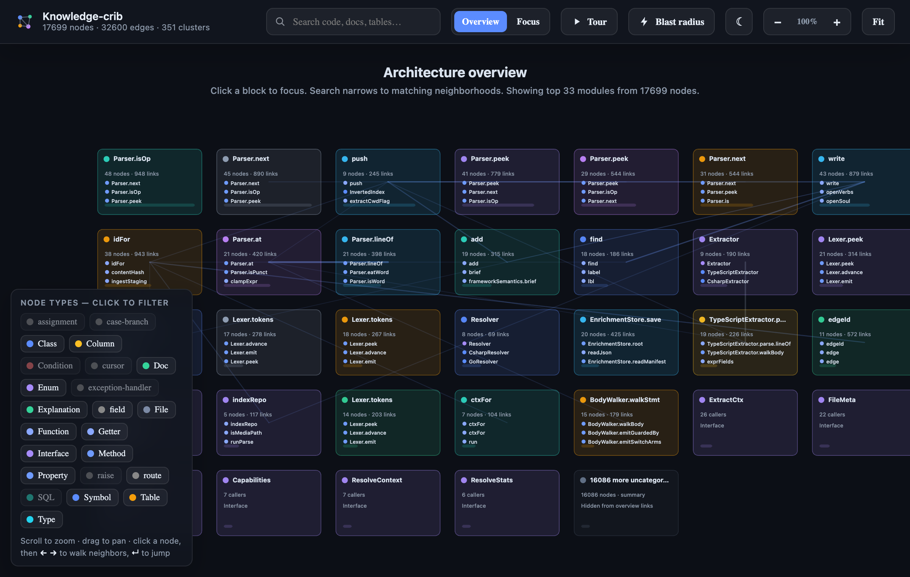

# Knowledge-crib

> A local-first knowledge graph and memory layer for AI coding agents, served over **one MCP
> server**. Index a repository once; every agent — Claude Code, Cursor, Copilot, Codex, Windsurf,
> Gemini — gets call graphs, blast radius, doc↔code links and durable project memory in a fraction
> of the tokens it would spend re-reading files.

**Status:** `0.1.0` release candidate · Apache-2.0 · Node ≥ 22.5 · not yet published to npm (install
from source below). The dated support boundary — what is measured, what is opt-in, known limits — is
in the [capability matrix](docs/capability-matrix.md).



---

## Why

Agents re-read files every session to rebuild an understanding of the codebase. That is slow,
expensive, and still misses architecture: who calls this, what breaks if it changes, what was
decided last week. Knowledge-crib parses the project into a committable graph (the **soul**), builds
a fast local index from it, and answers those questions directly.

Measured on this repository (reproduce with the commands shown):

| workload | without crib | with crib | saving |
|---|---|---|---|
| one cross-package task (`pnpm ab:task`) | 26,286 tokens | 1,415 tokens | **18.6×** |
| six discovery queries (`pnpm bench`) | 151,072 tokens | 3,339 tokens | **45.2×** |

CI enforces a ≥ 3× floor (`pnpm budget:check`). The deterministic core — parse, graph, impact,
search — never needs a network, and the server itself makes no model calls.

## Quick start

```bash
git clone https://github.com/KnowledgeCrib/knowledge-crib.git && cd knowledge-crib
corepack pnpm@9.15.0 bootstrap /path/to/your/repo
```

`bootstrap` installs dependencies, builds every package, puts `crib` on your `PATH`, and runs
`crib setup` on the target repository. Setup indexes it, installs the git hooks, writes the MCP
config and the agent protocol for every supported client, installs the on-device embedding model,
creates the memory stores, and finishes with `crib doctor`. Restart your editor and the
`knowledge-crib` MCP server is available.

Already have `crib` on your `PATH`?

```bash
crib setup .     # index + hooks + MCP wiring + agent protocol + model + memory + health check
crib doctor .    # ✓/✗ health check with fix hints
```

| setup flag | effect |
|---|---|
| *(default)* | installs the `large` embedding model (~2.1 GB, one time, offline afterwards) |
| `--embed-model small` | ~97 MB model, lower paraphrase recall |
| `--no-embed` / `KCRIB_NO_EMBED=1` | no model — memory recall stays lexical |
| `--embed-from <dir>` | adopt a pre-fetched model bundle (air-gapped hosts) |
| `crib init --ide detected` | wire only the clients this machine actually uses |

## How it works

```
parse → graph → persist as a committable soul (.crib/graph) → derived SQLite/FTS5 index → MCP
```

- **Soul** (`.crib/graph`) — deterministic JSONL extracted from the code, plus grounded
  model-authored analysis kept in a separate layer. Commit it; it merges with a bundled git driver.
- **Index** — derived SQLite + FTS5, gitignored and rebuildable. Code search is BM25 by default;
  vector retrieval over code is opt-in (`crib index --vectors`).
- **Memory** — a bi-temporal ledger of reusable, evidence-backed claims (team memory over Git,
  local memory per machine, opt-in encrypted cross-device sync) and resumable work intakes.
- **Freshness** — git hooks, `crib serve --watch`, or a background worker keep the index current.
- **Languages** — TypeScript/JavaScript, Python, Java, C#, Go, Rust, PHP, PL/SQL, Markdown,
  MuleSoft, and agent artifacts (skills, rules, instructions). Counts live in
  [docs/STATS.md](docs/STATS.md).

## MCP tools

| tool | use it for |
|---|---|
| `query` | find code and docs by concept (BM25, optional vectors) |
| `context` / `source` / `dossier` | everything about one symbol, its body, or a persisted deep brief |
| `impact` | blast radius (`dir: "up"`), dependencies, owners, shortest path |
| `neighbors` | raw graph adjacency and doc↔symbol links |
| `review` / `detect_changes` | what a change touches, who calls it, prior decisions about it |
| `rename` | call-graph-aware rename: dry-run plan, then apply by `planId` |
| `explain` | taint/dataflow findings for one callable (TS/JS) |
| `overview` / `status` | architecture summary, index health, coverage gaps |
| `brief` / `memory_recall` / `memory_observe` / `memory` / `memory_graph` | project memory: recall, record, handoff, intakes |
| `enrich` | host-agent-authored semantic analysis work queue |

Full request/response reference: [docs/mcp-api.md](docs/mcp-api.md).

## CLI essentials

```bash
crib index .                     # full index
crib update .                    # incremental, since the last indexed commit
crib query "session refresh"     # search
crib impact <symbol> --dir up    # who breaks if this changes
crib serve . --watch             # MCP server on stdio, edits queryable without re-indexing
crib viz .                       # offline graph + memory UI in the browser
crib memory recall "<topic>"     # recall team + local memory
crib --help                      # every command
```

## Documentation

| | |
|---|---|
| [User guide](docs/user-guide.md) | install, daily workflow, every verb |
| [Client setup](docs/client-setup.md) | wiring each IDE / agent |
| [CLI reference](docs/cli.md) | every command and flag |
| [MCP API](docs/mcp-api.md) | tool request/response specs |
| [Architecture](docs/architecture.md) | system design |
| [Memory sync](docs/memory-sync.md) | encrypted cross-device sync |
| [Capability matrix](docs/capability-matrix.md) | what is verified, on what |
| [All docs](docs/README.md) | full index |

## Development

```bash
corepack enable
corepack pnpm@9.15.0 install
corepack pnpm@9.15.0 verify          # build + tests + lint + boundary/credential/license checks
corepack pnpm@9.15.0 release:verify  # the full release gate CI runs
```

See [CONTRIBUTING.md](CONTRIBUTING.md). Security reports: [SECURITY.md](SECURITY.md).

## License

Apache-2.0 — see [LICENSE](LICENSE) and [NOTICE](NOTICE). GitNexus and Graphify are credited as
design inspiration only; no code is derived from either.
