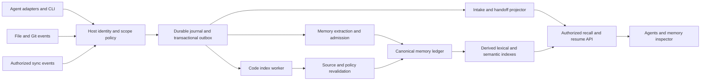

# Knowledge Crib: enterprise architecture and launch audit

**Audit date:** 5 September 2026  
**Source baseline:** `544bb8d3bdd37985dc1fdd74b7a61d986d978b86`, branch `debug/auditMaster`  
**Audience assumption:** individual developers and engineering teams using several AI coding agents; a hosted multi-tenant service is a later deployment class.  
**Decision:** **Hold the broad “persistent memory for any agent” launch. Continue an explicitly scoped technical preview while closing the correctness and automation gaps below.**

> **Remediation status:** F01, F02, F03, F06, F08, F10, F11, F13 and F14 are repaired and
> re-verified against the reproductions below; F05 and F07 are partly closed. See
> [remediation.md](remediation.md) for the evidence and for what remains open. **The launch decision
> above is unchanged:** the gates this audit did not run (three-OS installer acceptance, the
> full-repository watch gate, fresh-machine semantic acceptance, the sync soak, an independent
> holdout) still stand, and G2/G3 still fail under the lexical default.

Knowledge Crib has a substantial implementation and a credible product direction. Its best opportunity is **evidence-backed project memory and recoverable work that remain useful when an engineer changes agents**. The code graph, memory ledger, and durable intake history can reinforce each other: remember why a decision was made, locate its source, detect when that source changes, and resume unfinished work with the new context.

That combination is promising, but it is not yet a reliably automatic product. This audit reproduced a schema compatibility crash, loss of acknowledged freshness work under concurrency, and inconsistent principal enforcement. The default retrieval benchmark fails its semantic quality gates. A real MCP watch probe also failed to discover newly added symbols despite successful overlay refresh logs. Installed adapters are broader than lifecycle automation, and lifecycle hooks currently capture event markers rather than substantive reusable lessons. A release documentation gate also fails.

Do not describe the product as perfect, universally superior, or enterprise-ready on this evidence. Equally, do not discard the architecture or replace it with a generic vector database. The priority is to finish and validate the operational behavior around the strong foundations already present.

## 1. Evidence and limits

Evidence labels used below:

- **R — reproduced:** observed against the freshly built checkout, including temporary isolated fixtures.
- **S — source:** established by inspecting the current implementation; not necessarily exercised end to end.
- **H — historical:** a repository document reports an earlier measurement; not remeasured here.
- **D — documented competitor capability:** described by official sources; not benchmarked here.
- **P — proposed:** an architectural recommendation or acceptance target, not an existing guarantee.

Knowledge Crib was the only memory/code-context system used for the repository. Bootstrap and recall ran before source exploration. The initial code query failed because `.crib/crib.json` was missing; source reads were the fallback until `crib index` repaired the index. Competitor research used public primary documentation only. No competing memory tools were installed or invoked. No product code was changed, no release was published, and no memory was shared with other devices or a team.

This is an architectural, functional, operational, and usability audit, not an exhaustive penetration test or certification. No paid vendor deployment was exercised. The full release pipeline, three-OS installer acceptance, full-repository watch latency gate, 15-minute sync soak, independent semantic benchmark, and 100k semantic production workload were not completed here. Their absence is explicitly carried into the launch gates.

### Fresh verification results

| Check | Result | Meaning and limit |
|---|---|---|
| `corepack pnpm@9.15.0 verify` | **PASS: 2,585 tests**, build and lint | Eight packages tested. Passing tests did not cover the new failures reproduced below. |
| Real stdio MCP self-hosted smoke | **PASS: 16 tools listed; 29 calls** | Includes real query/context/memory reads and validation/dry-run paths. Not proof that every mutation works. |
| `release:metadata` | **PASS** | Metadata checks only. |
| `pack:check` | **PASS for its listed packages** | Its hardcoded list omits `packages/memory`; see F10. |
| `capabilities:check` | **FAIL, exit 1** | Runtime manifest: 16 tools / 46 operations; API document: 16 / 41. |
| `security-doc-check.mjs` | **PASS** | Checks that security documentation contains specified controls. It is not a runtime security verdict. |
| Production dependency audit | **16 advisory entries: 7 high, 8 moderate, 1 low; 0 critical** | Dependency advisories, not 16 demonstrated exploitable product flaws. Reachability triage is required. |
| Default lexical launch benchmark | **6/8 gates pass; G2 and G3 fail** | 307 corpus records, 500 queries. Results apply to the benchmark's explicit lexical scorer. |
| Concurrent freshness queue | **FAIL in three trials** | Acknowledged entries disappear; concurrent writers also hit `ENOENT`. |
| Version-2 principal probe | **FAIL for direct lookup/history** | Recall filters a foreign private record, but `get` and `history` return it through the same API instance. |
| Version-3 compatibility probe | **FAIL** | Valid persisted record crashes search even for its owning principal. |
| Graph coverage | **Incomplete** | 5,175 unresolved call sites reported on this self-index; counts include tests/fixtures/builtins and are not an accuracy percentage. |
| Real MCP file-save watch probe | **FAIL: 0/10 updated symbols discovered within 7 s** | One-file fixture, sequential edits; diagnostics confirm overlay refresh. This is a functional failure, not a valid p95 latency measurement. |
| Optional HTTP request boundary | **Foreign Host/Origin accepted for initialization** | Local synthetic-header probe returned HTTP 200. Browser exploitability was not tested. |
| Local doctor after rebuild | **11/12** | The configured embedder directory is missing. Manual freshness mode; no worker running. |
| Live browser inspection | **Graph and memory panel load** | Empty memory state lacks a recovery/capture action; filter labels have poor visible contrast in the observed dark view. |

The original index repair reported 756 files, 38,513 extracted nodes and 88,390 edges in approximately 77 seconds. Subsequent composite exports include semantic artifacts and have different counts. Do not present those views as directly comparable graph sizes or use this run as a controlled indexing benchmark.

Source logs and executable probes are in [evidence](evidence/README.md). Detailed official-source comparison is in [competitor-research.md](competitor-research.md).

## 2. Where Knowledge Crib is strong

### A. Durable truth and derived indexes are separated

The graph is persisted as inspectable artifacts; SQLite/FTS and vector materializations can be rebuilt. Memory uses content-addressed records and append-only lifecycle decisions. This is useful for debugging, portability, review, and recovery. The memory package keeps canonical records separate from retrieval indexes rather than treating an embedding database as the sole source of truth. **S**

Sources: [core](../../../packages/core/src), [memory store](../../../packages/memory/src/store.ts), [persistent FTS](../../../packages/memory/src/persistent-fts.ts), [vector store](../../../packages/memory/src/vector-store.ts).

### B. Trust and freshness are explicit parts of recall

Evidence, trust, applicability, and lifecycle are separate concepts. A memory can remain historically true while becoming inapplicable to today's source. Candidates do not become trusted merely because an agent says they are correct. Local negative feedback is prevented from silently retracting team knowledge. These are meaningful enterprise design choices, provided all schemas and API paths honor them. **S; baseline tests pass**

Sources: [evaluator](../../../packages/memory/src/evaluator.ts), [promotion](../../../packages/memory/src/promotion.ts), [recall](../../../packages/memory/src/recall.ts), [generation cache](../../../packages/memory/src/generation-cache.ts).

### C. Work continuity is a distinct product capability

Durable intakes preserve interpreted outcomes, scope, acceptance criteria, checkpoints, and the next safe action. Bootstrap checks saved repository state and avoids inventing a primary continuation when several intakes are resumable. This addresses a real failure in agent workflows: remembering facts is insufficient if the next agent cannot reconstruct what work remains. This audit used the intake/checkpoint path successfully. **R/S**

Sources: [intake](../../../packages/memory/src/intake.ts), [intake projection](../../../packages/memory/src/intake-projection.ts), [handoff](../../../packages/memory/src/handoff.ts).

### D. The local/global/team distinction is implemented

Project-local memory lives under `~/.crib/memory/repos/<repoId>`, global personal memory under `~/.crib/memory/global`, and team memory under the repository's `.crib/memory/team`. “Global” means cross-project on a machine; it does not automatically mean cloud, public, or synchronized. Encrypted device sync and explicit Git-backed team sharing are separate mechanisms. That is a good boundary to preserve. **S**

Sources: [paths](../../../packages/memory/src/paths.ts), [sync operator guide](../../memory-sync.md).

### E. There is already substantial engineering infrastructure

The repository has real parsers, graph analysis, bounded MCP responses, safe-rename planning, memory evaluation, migrations, sync validation, and a working local explorer. The eight-package suite and real MCP smoke passed. Packaging/legal checks and a three-OS release workflow exist. This is beyond a concept demo, although several release claims run ahead of the verified behavior. **R/S**

## 3. Competitive position

Compare products by workload. Mem0 is primarily application/conversational memory; GitNexus is code intelligence; Letta combines an agent runtime with memory; Zep/Graphiti emphasize temporal context. Winning a graph benchmark does not establish conversational memory quality, and vice versa.

| Dimension | Knowledge Crib today | Competitive benchmark | Launch implication |
|---|---|---|---|
| Automatic useful capture | Portable capture API; Claude event markers; agent-authored observations and explicit distillation | Mem0 documents capture, background processing and automatic first-session recall | Highest adoption gap: a connected MCP server must lead to useful memory without repeated user prompting. |
| Code intelligence | Parsers, callers/callees, impact, dossiers, framework semantics, rename, bounded taint analysis | GitNexus documents execution-process exploration, cross-file resolution and a graph explorer | Publish language/framework-specific correctness evidence; breadth alone is insufficient. |
| Durable execution handoff | Explicit intake/checkpoint/drift model | Competitor memory helps continuity but is not the same acceptance contract | Demonstrate an interrupted task resumed in a different client. |
| Semantic retrieval | Optional pinned local embedder; lexical fallback; immutable vector cache | Mem0 and temporal-memory products emphasize meaning-based retrieval | Offer a supported semantic installation path and gate the actual default package. |
| Personal/project/team ownership | Three stores plus evolving versioned namespace model | Mem0 documents personal/project scopes; Zep documents agent action/context policies | Repair all-path authorization before offering shared or hosted deployments. |
| Git-backed memory | Reviewable graph/team ledger | Letta's current MemFS is also Git-backed | Git storage is not an exclusive differentiator. |
| Refresh | Dirty-worktree overlay, incremental update, durable worker components | GitNexus documents stale-index hooks and separately enterprise auto-reindexing | Distinguish uncommitted-file watch, Git transitions, memory validity and device sync. |
| User inspection | Graph explorer and read-only memory ledger | OpenMemory advertises memory inspection, visibility controls and access logs | Add a memory operations view, not only a graph panel. |
| Enterprise operations | Local filesystem/process trust; encrypted user-owned sync | Zep documents administrative RBAC, agent/API ABAC and separate logs | Position first as a local developer tool; shared-service governance is a separate readiness gate. |

Official sources: [Mem0 integration](https://docs.mem0.ai/integrations/claude-code), [GitNexus repository](https://github.com/abhigyanpatwari/GitNexus), [Letta MemFS](https://docs.letta.com/concepts/memfs), [Zep policy controls](https://help.getzep.com/policy-based-access-control), [OpenMemory](https://mem0.ai/openmemory). These are documented capabilities, not comparative measurements performed here.

The defensible positioning is:

> **Project knowledge and unfinished work that follow you across supported AI agents, with evidence and source freshness you can inspect.**

Avoid “the only Git-backed memory,” “all agents automatically supported,” “best retrieval,” or “zero-cost updates.” The existing [launch comparison](../../launch/comparison.md) includes an exclusive intersection claim and stale tool counts; it needs a dated, release-pinned comparison before promotion.

## 4. Findings ranked by launch impact

Priority expresses impact on the intended product promise, not a numerical security score. P0 requires correction before launching the affected functionality; P1 must be resolved or explicitly excluded from the initial supported promise; P2 is a bounded follow-up.

### F01 — P0: supported memory-3 records break ordinary search

**Evidence: R/S.** A valid version-3 record was written through `MemoryStore.upsertEntries`. Search then threw `Cannot read properties of undefined (reading 'lifecycle')`, including when the caller was the record's own principal. `effectiveVerdicts` recognizes only version 2 before falling into the version-1 path and reading `record.verdicts`. Version 3 has no such field. `recordPrincipalId` likewise recognizes version 2 only, allowing a foreign version-3 record into the gathered pool.

Sources: [evaluator.ts](../../../packages/memory/src/evaluator.ts) around 890–912; [recall.ts](../../../packages/memory/src/recall.ts) around 260–266 and 572; [types.ts](../../../packages/memory/src/types.ts) around 445–471. A shared `isMemoryRecordVersioned` helper already exists.

**Action:** review every schema-dependent branch across recall, ranking text, scope, history, promotion, sync and aliases. Use the governance-aware union where appropriate; do not blindly replace every v2 check. Add store→search/get/history/ledger→migration tests for v1/v2/v3, both owner and foreign principal. A storage round-trip test alone is insufficient.

### F02 — P0 for automatic freshness: concurrent writers lose acknowledged queue entries

**Evidence: R/S.** Eight child processes each attempted 25 distinct project updates against an isolated registry. Across the final three trials, 45/41/38 calls returned successfully, but 44/39/34 of those acknowledged project entries were missing afterward. Other calls failed with `ENOENT`. No worker drained the queue, and every project key was distinct, so these losses cannot be explained by intended coalescing.

`writeJsonAtomic` uses the shared `queue.json.tmp` filename. Enqueue performs an unlocked read-modify-write of the entire queue. Unique temp names would remove one collision but would not solve lost updates. Worker claims and lease acquisition also need interprocess serialization. The memory store already has a locking pattern; the freshness subsystem does not inherit it.

Sources: [freshness.ts](../../../packages/cli/src/freshness.ts) around 148–174, 201–224, 427–456 and 537–553; [probe results](evidence/probe-results.json).

**Action:** use transactional queue storage or a correctly locked single-writer journal with atomic lease acquisition. Acknowledge only durable state. Add producer/producer, producer/consumer, worker/worker, crash/replay and newest-HEAD coalescing tests. These probes demonstrate loss of refresh work, not deletion of canonical memory records.

### F03 — P1: principal enforcement differs between recall and direct access

**Evidence: R/S.** A private v2 record for principal B was stored in an isolated store. Principal A's `gatherRecall` excluded it, while `MemoryApi.get(id)` returned its content and `history(id)` returned one record. `locate` and `gatherAllRecords` do not apply the recall ownership filter. Version 1 also lacks ownership metadata; the benchmark reports an 18.7% foreign-result rate in its intentionally mixed v1 store probe.

Sources: [api.ts](../../../packages/memory/src/api.ts) around 2113–2149, 3227–3245 and 3295–3309; [recall.ts](../../../packages/memory/src/recall.ts) around 338–370; [probe results](evidence/probe-results.json).

**Action:** one host-resolved authorization decision must govern reads, history, ledger, evidence expansion, aliases, exports and mutations. Define workspace/team membership separately from author identity: simply filtering all team records to the current author would break collaboration. Require migration or quarantine for unstamped legacy records in shared deployments. Client/session/profile IDs are provenance, not credentials.

**Deployment limit:** this is an API isolation defect under a shared-store configuration, not evidence of a remote unauthenticated exploit in the default stdio local process tested here. An additional optional loopback HTTP transport also exists; see F14. The OS user and filesystem still bound that process. Do not turn it into a multi-tenant endpoint until the contract is enforced everywhere.

### F04 — P1: lifecycle capture does not yet capture useful memory

**Evidence: S/R.** `cmdMemoryCaptureHook` discards message/tool content and stores only bounded session/tool identifiers plus generic observations such as “session turn ended.” That protects the no-transcript policy, but it cannot recover the decision or lesson the user expects to remember. Repeated same-event/session/tool calls intentionally collapse. Bootstrap exposed pending lifecycle markers, while the active ledger was empty. Other supported clients rely on instruction-based behavior.

Sources: [cli.ts](../../../packages/cli/src/cli.ts) around 4900–4996; [adapters.ts](../../../packages/cli/src/adapters.ts); [distill.ts](../../../packages/memory/src/distill.ts).

**Action:** introduce client-neutral structured outcome events: sanitized intent, explicit decision, relevant artifact references, verified result receipt, next action, and event offset. Hook events should trigger collection/checkpointing rather than masquerade as reusable facts. Keep raw transcripts and chain-of-thought prohibited. Make background distillation and admission observable and budgeted; do not bypass evidence gates to make counts grow.

### F05 — P1: the semantic launch result is not the default user experience

**Evidence: R/H/S.** This machine's configured model directory is missing. The rebuilt CLI falls back to lexical memory retrieval. The explicitly lexical launch harness measured G2 paraphrase recall@5 **2.61%** and G3 MRR **0.520**, against thresholds of 80% and 0.75. Historical documents report **81.0% / 0.881** with multilingual-e5-large and claim-only embedding. Those results require that model/adapter/configuration; this audit did not reproduce them.

Sources: [launch gates](../../bench/launch-gates.md), [launch evidence](evidence/lexical-launch-gates.json), [CLI scorer](../../../packages/cli/src/cli.ts) around 5978–6030, [embed installation](../../../packages/core/src/embeddings/embed-install.ts).

**Action:** distribute a supported, version-pinned semantic setup with model size, download policy, license, device requirements, checksum and a small real recall test. Surface retrieval mode in the UI and every benchmark. Fresh-machine semantic acceptance must precede a general persistent-memory quality claim. Do not lower the frozen thresholds just to label lexical fallback as equivalent.

### F06 — P1: freshness components are not an automatic installation contract

**Evidence: S/R.** Manual is the persisted default. Setting `auto` instructs the user to start a worker or service manager; it does not itself install a supervised service. `serve` enables the overlay only with `--watch`, while generated MCP arguments omit that flag. The source comment describing watch as the default while serving is therefore stronger than the wiring.

Sources: [freshness.ts](../../../packages/cli/src/freshness.ts) around 47–59; [mcp-install.ts](../../../packages/cli/src/mcp-install.ts) around 150–161; [cli.ts](../../../packages/cli/src/cli.ts) around 1885–1906 and 2788–2824; [watch.ts](../../../packages/cli/src/watch.ts).

**Action:** make the chosen freshness policy configure the actual serving process and supervised worker, with startup/restart/uninstall behavior. Reconcile state on startup and Git transitions, not only hook notifications. Record the actual indexed HEAD when publishing a generation: the current worker's update reads the live tree while publication labels `task.head`, so transitions during processing need explicit tests. Publish separate code-index and memory-validity status.

A “zero commit tax” claim is also too literal: the auto hook synchronously launches the CLI path and performs queue I/O. It avoids blocking on expensive reindexing, but its elapsed overhead is not mathematically zero. Measure and publish the bounded hook cost.

### F07 — P1: green verification can coexist with failed launch criteria

**Evidence: R/S.** Capability documentation fails 41 versus 46 operations. `launch-eval.test.ts` asserts structural gates and fixed thresholds but does not require G2/G3 to pass. The standalone comparison runner uses `runLaunchGate()` with the lexical default, renders failures, and exits normally. The release script does not invoke a semantic launch acceptance runner. Consequently, test success and a historical “8/8” document do not prove the packaged configuration meets the launch promise.

Sources: [capability failure](evidence/capabilities.log), [launch tests](../../../packages/memory/src/bench/launch-eval.test.ts) around 123–165, [comparison runner](../../../scripts/launch-vendor-compare.mjs) around 342–369, [release verification](../../../scripts/release-verify.mjs).

**Action:** one release evidence manifest should bind commit, schema versions, adapter/model identity, scorer, client versions, platform and workload to pass/fail results. Required quality gates must fail the release job. Keep lexical fallback tests honest and separate from semantic acceptance. Generate current capability documentation from the manifest.

### F08 — P1: dependency advisories need a release disposition

**Evidence: R.** The production dependency audit returned seven high, eight moderate and one low advisory entries. Affected transitive packages include `fast-uri`, `ip-address`, `hono`, `@hono/node-server` and `qs`. Some arrive through HTTP middleware in the MCP SDK despite the default Crib transport using stdio; exposure must be analyzed rather than assumed.

Sources: [dependency summary](evidence/dependency-summary.json), [full advisory result](evidence/dependency-audit.json). These include current advisory URLs, installed paths and patched ranges.

**Action:** update compatible patched dependencies, test the distributed artifacts, and document reachable versus unused vulnerable paths. Require no unresolved reachable high/critical issues for release; formally record bounded exceptions with owners and expiry. A prose security checklist is not a substitute for dependency and dataflow evidence.

### F09 — P1 for the memory product: UI does not explain the memory lifecycle

**Evidence: R/S.** The local graph explorer loads and exposes Overview, Focus, Tour, Blast radius and Memory. The memory panel says “No records in this view” even while bootstrap reports pending captures. It provides no action to inspect pending work, choose scope, repair a failed embedder, or resume the active intake. Dark-view filter labels were difficult to distinguish against pale button backgrounds in the observed 1280×720 view. That is a visual finding, not a measured WCAG conformance result.

Sources: [web UI](../../../packages/ui/web/index.html) around 277–371 and 1258–1290; [read-only routes](../../../packages/cli/src/cli.ts) around 3075–3150.

**Action:** add a memory home with Active / Pending / Needs review / History / Work to resume. Show owner, scope, source/evidence, reason returned, last successful capture/index/sync and retrieval mode. Explain empty states with an immediate next step. Add keyboard/focus/contrast and narrow-window acceptance. Keep the graph as a linked inspection surface; a dense edge view should not be the only introduction to persistent memory.

### F10 — P1 for distribution evidence: package validation omits the memory package

**Evidence: S/R.** `pack:check` passed, but its package array includes seven packages and omits `packages/memory`. The installer builder already includes memory, so this is a coverage defect in the pack gate, not proof that installers omit memory.

Sources: [pack-check.mjs](../../../scripts/pack-check.mjs) around 8–16; [installer builder](../../../scripts/build-installers.mjs) around 19–31.

**Action:** derive the publishable package set from workspace metadata, validate every tarball and dependency, and install only those tarballs into an empty environment. The README's workspace-link setup is a developer path, not proof of clean-customer distribution. Installer signing deferral remains a draft decision in [its ADR](../../launch/signing-deferral-adr.md); this audit does not approve or close that decision.

### F11 — P2, elevated for graph accuracy claims: graph completeness and confidence need calibration

**Evidence: R/S.** The graph reports incomplete readiness. In a concrete context query, the injected `now()` callback in `enqueueFreshness` was linked at confidence 1 to unrelated symbols such as `cmdMemoryDistill.now` and `FreshnessWorker.now`. That is a misleading resolved edge, distinct from an openly unresolved call site. A deterministic graph can still be deterministically wrong.

Sources: [context response](evidence/freshness-graph-context.json), [gap report](evidence/graph-gaps.json), [freshness source](../../../packages/cli/src/freshness.ts) around 201–219.

**Action:** build independently labeled fixtures for callbacks, shadowing, dynamic dispatch, object members, overloads, cross-file calls and framework injection. Report edge precision and recall by resolution method/language, including unresolved coverage. Confidence should reflect method reliability. Rename and blast-radius acceptance should exercise these ambiguous edges, not infer safety from empty or confident results.

### F12 — P2, elevated for enterprise operations: growth, sync and recovery remain operator-heavy

**Evidence: S/H.** Encrypted sync, replay, conflict handling and tombstones are implemented, but operator documentation carries manual key rotation, deferred log compaction and proxy-based HTTP storage integration. Historical performance gates leave a real sync soak and full-repository watch measurement open. Old scale figures and semantic quality figures are from different configurations; they cannot be combined into a single performance claim.

Sources: [memory sync](../../memory-sync.md), [performance gates](../../bench/perf-gates.md), [scale curve](../../bench/scale-curve.md), [vector store](../../../packages/memory/src/vector-store.ts).

**Action:** define restore/export, deletion propagation, offline-device return, key revocation, retention and compaction workflows. Test disk-full and interrupted migration behavior. Distinguish process-crash survival from power-loss durability; temp→rename without an established flush contract is not sufficient evidence of the latter. Do not make irreversible deletion claims for bytes already committed to Git history.

### F13 — P0 for automatic code freshness: the watched graph is not the query index

**Evidence: R/S.** In a one-file TypeScript Git fixture, plain `serve` continued to return the old symbol after a save, as expected without watching. With `serve --watch`, **none of ten sequential replacement symbols appeared in MCP query within seven seconds**. A second diagnostic run returned empty hits while stderr confirmed both initial and later file refreshes, each adding two nodes and two edges. The failure is not an ID-matching mistake: the returned hit lists were empty.

The wiring explains the result: `cmdServe` supplies the original `index` and separately `workingOverlay: overlay.store`; `Verbs` installs that overlay in `GraphStore`, but `query` calls `this.deps.index.query(...)`. Refreshing the graph view never refreshes that query index. Existing watcher tests assert overlay nodes/edges rather than discovery through the serving boundary.

Sources: [cli.ts](../../../packages/cli/src/cli.ts) around 1885–1920; [verbs.ts](../../../packages/mcp/src/verbs.ts) around 493–501 and 1330; [watch tests](../../../packages/cli/src/watch.test.ts); [full probe](evidence/watch-results.json); [diagnostics](evidence/watch-diagnostic.json).

**Action:** publish a consistent overlay graph and query index generation, with matching invalidation for `query`, `brief`, source/context lookups and `ifHash`. Test a newly named symbol through real MCP after a save, rename and deletion. Never count the probe's seven-second timeout values as successful update latency; the existing full-repository 50-sample p95 gate still needs a separate run after this functional defect is fixed.

### F14 — P1 for shared-daemon use: HTTP transport is missing from the security contract

**Evidence: R/S.** `crib serve --http` is implemented and defaults to loopback. Unlike the visualization server, its request handler has no explicit Host/Origin allowlist or caller authentication, and buffers all body chunks before parsing without a visible byte cap. A local `initialize` request with `Host: audit-untrusted.example` and `Origin: https://audit-untrusted.example` received HTTP 200. The audit exercised initialization only; it did not attempt a browser exploitation chain, resource exhaustion, or remote exposure.

Sources: [server.ts](../../../packages/mcp/src/server.ts) around 895–955; [HTTP probe](evidence/http-boundary.json); [CLI transport wiring](../../../packages/cli/src/cli.ts) around 1924–1948. The security-document gate still passes a “stdio-only” inventory assertion, so its green result misses an actual transport.

**Action:** inventory this supported surface; define local caller identity and authorization, enforce Host/Origin policy, cap request bytes and time, and test all mutation methods as well as reads. Consider a permissioned OS-local socket or explicit authenticated loopback access. Do not rely on separate per-request MCP transport objects as user isolation: the `verbs` object and its process identity are shared. Reuse this existing daemon for resource efficiency only after its boundary is explicit.

## 5. Target architecture for frequent, trustworthy updates

**Recommendation: complete one client-neutral lifecycle around the existing stores.** Preserve the memory ledger and graph; consolidate duplicated sidecar/worker conventions rather than replacing the system wholesale. The existing intelligence event journal, projector checkpoints and optional shared HTTP daemon are useful starting points, but event types and status classes do not by themselves prove that all producers and consumers are wired.

This is **P**, not a claim that the full diagram runs automatically today. Heavy extraction must stay off the foreground interaction path. Every durable stage needs an idempotency key, owner/scope, source revision, processing state, attempts, last error and a recoverable next step.

### Seven update loops, with distinct success signals

| Loop | Trigger and work | Current foundation | Required completion behavior |
|---|---|---|---|
| Code freshness | File save/rename/delete, branch switch, merge/pull/checkout; debounce and VCS reconciliation | `WatchMode`, working overlay, incremental index | A changed symbol is queryable at the correct generation; expose partial/stale state and last good generation. |
| Durable work | Meaningful progress, compaction, exit, idle, restart | Intake/checkpoint/bootstrap | Same authorized principal resumes from another client without the original session ID. |
| Reusable memory | Explicit lesson or structured evidence-bearing outcome | Capture outbox, distillation, evaluation | Acknowledgment means recoverable capture; admission status is separate from “saved.” |
| Fact validity | Source, policy, receipt, supersession or time changes | Evaluator and generation cache | Inapplicable facts leave current recall, history remains inspectable, ambiguous reattachments request review. |
| Device propagation | Explicit sync configuration, reconnect, authorized changes | AEAD sync engine, reconciliation and tombstones | No unapproved sharing; duplicates/reordering converge; deletion and conflict state survive offline return. |
| Maintenance | Idle window, queue/storage thresholds, periodic budget | GC/vector pruning and operator procedures | Bounded retained logs/indexes, replay-safe compaction, observable failures and backup health. |
| Product upgrades | Signed/versioned release and configured update policy | Release/build/installer workflow | Compatibility preflight, backup, migration test, rollback and client protocol compatibility. Software upgrades must not silently change memory semantics. |

**P — scheduling defaults:** file events can use the existing 300 ms debounce and 2 s VCS backstop; semantic extraction should batch on useful event volume or idle time; maintenance should have a bounded daily budget. Device sync should remain opt-in. These are candidate policies, not measured guarantees. Do not auto-promote claims or run a provider merely because a file watcher fired.

**P — service ownership:** the existing shared daemon can evolve into a per-OS-user service supervising workers and accept requests from several local MCP clients. Use transactional leases and a stable installation path; bind local sockets/loopback only until authenticated remote access is deliberately designed. Harden the existing HTTP boundary and test the worker under concurrency, then decide whether SQLite queue tables or the existing locked-journal mechanism is the simpler reliable implementation. Avoid introducing a distributed service for a single-user desktop requirement.

### Identity that survives agents, IDs and IDEs

“Regardless of agent ID” should mean **access follows the authorized user and project, while client IDs only describe provenance**. It must not mean that callers can select any owner by presenting an arbitrary ID.

| Identifier | Meaning | Changes to tolerate |
|---|---|---|
| Principal | Authorized human/service owner | Login/device changes through an explicit identity mapping, never a client-supplied override |
| Workspace/team | Collaboration boundary and memberships | Join/leave/revoke without rewriting authorship |
| Project | Stable repository/project identity | Checkout path move, new clone, worktree, remote URL change with explicit reconciliation |
| Agent profile | Optional durable role/preferences | Same reviewer role in different vendors; alias registration is not permission |
| Client/session/event offset | Origin and replay deduplication | Every new session/model/client version |
| Device | Sync and revocation provenance | New machine, lost machine, restored backup |

The v3 namespace and agent profile directory are directionally appropriate. Complete their use at every boundary. Add a conformance test that saves a constraint in client A, recalls it from B with a new session ID, resumes an intake in C, moves the repository, and confirms a different principal still sees none of the private content.

### Scope and precedence

Keep placement separate from applicability. A global memory can be physically present without being relevant to a project; project memory must not silently become global. Scope expansion should be explicit and auditable.

A proposed resolution policy is: explicit current task constraints and applicable project policy take precedence over a personal preference, while contradictory evidence remains visible. Do not silently overwrite a global preference with a one-project exception. Keep canonical memories as evidence for the consuming agent; they never override the agent's system/developer instructions or grant authority to act.

### Reliability and operational telemetry

Expose `lastCaptured`, `lastAdmitted`, `lastIndexed`, `lastValidated`, `lastSynced`, pending/dead-letter counts, actual source generation, retrieval mode, worker health and model identity. “Connected” alone is not a health signal. A queue can be empty because work finished, because capture never ran, or because a failure lost work.

Define an explicit durability contract: process crash versus OS crash/power loss, local disk versus network filesystem, and whether acknowledged writes require flush/fsync. Validate recovery from truncated journals, disk-full, interrupted migration, stale leases and restored backups. Trace by event ID without storing raw transcripts or secrets. Persist diagnostics locally by default; telemetry export should be a separate user choice.

## 6. Efficiency and effectiveness must be measured together

The historical performance document reports warm 10k/100k recall at 8.3/132.8 ms after loop-hoisting work. It also explains that those measurements did not cover the eventual semantic embedding workload. Treat these as historical configuration-specific observations, not today's universal end-to-end latency. The persistent vector cache is a sound optimization: immutable record IDs permit vector reuse, but query embedding, candidate evaluation, cross-process startup and model loading still matter.

Use three benchmark families:

1. **Memory quality:** exact/paraphrase/multilingual recall, contradiction and supersession, correct abstention, irrelevant-memory interference, false admission, long-horizon preference changes, and temporal answers.
2. **Code intelligence:** labeled callers/callees and blast radius by language/framework; false positive edges; refactor survival; deleted/renamed symbols; unsupported syntax and incomplete indexes.
3. **Operational outcomes:** capture→admission→recall lag, cross-client task resumption, concurrent writers, cold/warm retrieval, branch transitions, crash recovery, sync convergence and deletion propagation.

Every report should name commit, package version, OS/CPU/RAM, corpus, model/adapter/scorer, warmup, iteration count, p50/p95/p99, errors/timeouts, memory footprint and concurrency. Include a small no-index baseline for context cost, but require equivalent answer/task quality before claiming savings. The README's modeled token savings compare chosen retrieval strategies; they are not proof of a universal productivity or cloud-bill reduction.

The launch corpus and R2 split were authored within the same development effort. Obtain an independently authored holdout and real pilot tasks before broad quality claims. Mem0's vendor-authored LOCOMO results use different baselines and cannot be compared numerically with Crib's frozen corpus. See the [competitor evidence](competitor-research.md#evaluation-and-claims-discipline).

## 7. Prioritized launch backlog

Sequence by dependency; these are work packages, not promises of delivery dates. “Small/medium/large” describes relative scope, not a fixed estimate.

| Order | Work package / owner role | Size | Acceptance evidence | Dependency |
|---|---|---|---|---|
| 1 | Versioned schema contract — memory core | Medium | F01 probe passes; v1/v2/v3 complete API/migration matrix; owner and foreign tests | None |
| 2 | Transactional freshness writes and leases — runtime | Medium | No acknowledged loss at 8 concurrent producers; producer/consumer and worker/worker races; kill/replay tests | None |
| 3 | Central authorization and HTTP boundary — security/API | Large | Denied private reads/history/aliases/ledger/evidence/mutations; HTTP origin/host/body/auth tests; authorized team sharing still works; legacy policy explicit | Schema contract |
| 4 | Release truth and dependencies — release engineering | Small–medium | Manifest/docs match; every package validated; advisory disposition; required semantic gates fail the job when red | None |
| 5 | Supported semantic installation — retrieval/distribution | Medium | Fresh-machine model acquisition and offline query test; pinned scorer; declared disk/RAM/startup budget | Release truth |
| 6 | Useful capture and checkpoint lifecycle — integrations | Large | Structured sanitized outcomes survive process exit and become eligible only after evidence checks | Queue + schema |
| 7 | Repair watch-to-query integration, worker supervision and freshness policy — runtime | Medium | Init actually enables selected mode; startup/reboot recovery; branch/save/delete/rename scenarios measured | Queue; F13 query overlay repair |
| 8 | Cross-client conformance — integration QA | Medium–large | Pinned-version matrix for Claude, Codex, Cursor, VS Code/Copilot, Windsurf and Gemini; explicit reduced mode where needed | Capture + identity |
| 9 | Memory operations UX — frontend/product | Medium | User can explain saved/pending/current/history, inspect evidence, diagnose missing memory and resume work | Status APIs |
| 10 | Graph accuracy fixtures — code intelligence | Medium–large | Callback/shadowing example corrected; method/language precision and recall published | No dependency for benchmark |
| 11 | Recovery, retention and sync soak — reliability | Medium–large | Restore, key rotation, offline return, tombstone replay, growth and interrupted operations exercised | Stable schema + queue |
| 12 | Independent evaluation and pilots — product/research | Ongoing | Real tasks across agents, independent holdout, customer-observed continuity improvements | Usable integrated candidate |

For public readiness, items 1–5 and a credible working subset of 6–9 are critical. A local-only preview can explicitly exclude multi-principal hosting and automatic cross-device sync, but it cannot advertise those as solved. Do not add more parsers or marketing superlatives while the accepted memory schema can break search.

### Proposed release acceptance gates

Retain already-frozen retrieval thresholds; do not retrofit them to an outcome. The operational additions below are proposed until adopted and measured.

| Gate | Acceptance contract |
|---|---|
| Schema compatibility | Every supported version survives save→recall→get→history→migration→sync; malformed/unsupported input fails closed with an actionable message. |
| Durability | Zero acknowledged event loss in documented concurrent/crash/replay scenarios; state the power-loss and filesystem limits. |
| Ownership | Zero unauthorized content/evidence/history leakage on every API surface and schema; authorized team access succeeds. |
| Retrieval | Existing G1–G8 pass with the distributed supported semantic configuration; independent holdout reported separately. |
| Code freshness | Existing <5 s p95 target measured over ≥50 updates after warmup on a named reference repository, including recovery and branch transitions; report timeouts as failures. |
| Recall performance | Existing <100 ms at 10k and <300 ms at 100k warm targets rerun through the actual served semantic path; report cold/model startup separately. |
| Client continuity | At least two independently exercised clients for initial release; per-client startup recall, useful capture, compaction/exit and recovery status published. |
| Sync | Dedicated soak and restart/reorder/duplicate/tombstone/offline return checks; no local-only data leaves the configured boundary. |
| Usability | A new user completes install→remember→restart→recall→inspect→resume without undocumented commands; visible queue/errors and keyboard-readable controls. |
| Distribution | Clean Linux/macOS/Windows install from actual artifacts; all packages present; migration/rollback procedure exercised; signing status explicit. |
| Security release | Current dependency triage plus dataflow/control tests; no unresolved reachable high/critical vulnerability; exceptions documented and dated. |

## 8. Launch and promotion strategy

### Initial buyer and practical value

Start with developers and teams that already switch coding agents, maintain long-lived repositories, or repeatedly lose project decisions between sessions. The buyer is an engineering lead or developer productivity owner; the user is the developer and their agent. Evaluate fewer repeated explanations, fewer rediscovered failures, correct continuation after interruption, and fewer stale-context mistakes.

Large regulated or hosted multi-tenant deployments require additional identity administration, revocation, access logs, deployment policy, restore guarantees and support ownership. Do not make that the implied default edition before those controls are tested.

### Product packaging

Publish a small promise with an honest capability matrix:

- **Local core:** inspectable graph and memory, explicit capture, bootstrap/handoff, supported semantic tier.
- **Automatic integration:** lifecycle adapters and supervised refresh, with verified client versions and reduced-mode disclosures.
- **Team workflow:** reviewed Git-backed knowledge and explicit sharing; no silent promotion of private memory.
- **Later enterprise layer:** managed distribution, policy administration, fleet diagnostics, audit/recovery and optional authenticated service access.

These are proposed packaging boundaries, not shipped editions or pricing. Preserve a useful open local core; enterprise value should come from operating and governing it well.

### Four demonstrations worth promoting after they pass

1. Fix a bug in one agent, capture the reusable cause/fix with evidence, then ask another agent in a new session. It recalls the relevant lesson without replaying the old conversation.
2. Change a source-backed architecture decision. Old advice leaves current recall; the inspector explains the invalidated evidence and preserves history.
3. Interrupt a task after a checkpoint. Resume in another client with a new session ID and verify the next step against the changed working tree.
4. Share a project lesson with the team while a personal preference stays private. Show the access boundary and explicit sharing action.

Each demo should publish exact setup, version, supported clients, time-to-useful-memory and a failure case. Use a small tutorial repository for onboarding; do not require users to understand the entire graph taxonomy first.

### Promotion sequence

First publish the architecture and a transparent technical preview. Next recruit a small set of multi-agent engineering teams and record failures through the durable intake system. After the acceptance gates pass, release the supported package, demo recipes and dated comparison. Then publish measured case studies and adoption evidence. Public posts and release actions require a separate execution step; none were performed by this audit.

Track activation (first useful memory recalled after restart), cross-client continuation success, week-two return use, stale/incorrect-memory reports, percentage of captures admitted with evidence, capture backlog age, repair/support burden and update failure rate. These metrics are more useful than raw stored-memory count or number of MCP verbs.

## 9. Recommended next execution step

Create a correctness workstream for **F01: schema-complete memory behavior**, using the included reproduction as the first regression. In parallel planning, specify the transactional freshness queue and shared authorization contract. Preserve the current ledger and graph architecture. Re-run the exact failing probes and release gates after the fixes; only then broaden the integration and launch claims.

This audit establishes a launch decision and implementation backlog. It does not claim that the product defects have been fixed.
