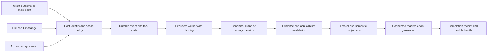

# Knowledge Crib: post-merge launch re-audit

**Date:** 5 September 2026. **Source baseline:** `3fa52e53b2e4d9e29200e1c621db3a4ecb173bf0`, branch `debug/auditMaster`. The working tree was clean at intake. This audit does not independently establish the remote main branch's contents. Product code was not modified, committed, published, or deployed.

## Decision

**Do not launch this revision as a dependable, automatic, universal persistent-memory product yet.** The architecture is worth continuing, and several previous defects are repaired. However, new runtime reproductions find lost refresh work, stale evidence resurfacing after migration, private intake isolation failures, and connected readers serving outdated search results while reporting an up-to-date graph.

The recommendation is a focused reliability and activation release, followed by an explicitly scoped technical preview and multi-client pilots. An enterprise general-availability claim requires additional authorization, operational, distribution, and independent evaluation evidence. No percentage-complete score is assigned: one failed durability or isolation invariant can block the launch regardless of the number of features or passing tests.

**The strongest product promise is:** “Your engineering decisions and unfinished work follow you between coding agents, with inspectable evidence and explicit privacy boundaries.” That promise is more defensible than “the best memory tool” or “a superset of GitNexus and Mem0.” It still needs the acceptance gates below.

## 1. What was actually audited

The audit restored Knowledge Crib handoff, created a private durable intake, queried its code context, checked graph honesty signals, reviewed current source and workflows, built and tested the workspace, replayed previous reproductions, added isolated failure probes, exercised the browser UI, and researched current primary-source competitor documentation. No competing memory or repository-context tool was installed or invoked.

Evidence labels:

- **R — reproduced now:** observed during this audit, with runnable probe or command receipt.
- **S — source-supported:** implementation or configuration reviewed; not necessarily exercised in its native deployment.
- **H — historical evidence:** committed prior measurements, not silently relabeled as current.
- **P — proposed:** recommendation or acceptance contract, not shipped functionality.

The source graph was initially behind HEAD and a live existing freshness worker held the index lock. The worker later refreshed it; a new CLI read and the MCP health endpoint eventually agreed on HEAD. No existing worker was killed or service reconfigured. The audit's destructive crash tests affected only its synthetic child processes and temporary stores.

### Fresh verification results

| Check | Result | Meaning and limit |
|---|---|---|
| Workspace build, test, lint: `pnpm verify` | **PASS: 2,648 tests across eight packages**; one lint warning | Strong regression coverage; not proof of the missing invariants discovered below. |
| Workspace typecheck | **PASS** | Current TypeScript contracts compile. |
| Package validation | **PASS: 8/8** | Includes memory and legal files. This is tarball validation, not clean-machine installation. |
| Production dependency audit | **0 advisories**, 110 dependencies | Dated advisory scan; not a penetration test or complete reachability analysis. |
| Capability and security-document checks | **PASS** | Manifest/docs consistency and documented security inventory checks. |
| Original producer queue reproduction | **600/600 acknowledged tasks retained**, zero errors | Three trials of eight processes × 25 tasks. Does not cover worker election/recovery. |
| Original private-record get/history reproduction | **PASS** | Foreign principal cannot directly retrieve the tested versioned record. Intakes remain a separate failure. |
| Original v3 search-crash reproduction | **PASS for no crash** | Does not prove native v3 admission or successful recall. |
| One-file stdio watch diagnostic | **10/10**, p95 **424 ms** | Small-fixture result only. |
| Reference-repository watch measurement | **50/50 saves**, p50 **1,969 ms**, p95 **2,116 ms**, p99 **2,122 ms** | 816 tracked files copied; 805 indexed; 39,720 nodes and 91,745 edges; two warmups; real MCP; 50 ms polling. Recovery cases fail separately. |
| Labelled graph fixture | **5 true positives, 0 false positives, 0 false negatives** | One small TypeScript fixture; cannot establish all-language accuracy. |
| Release evidence, `--require-pass` | **FAIL**, exit 1 | Required failures: `semantic-model`, `G2`, `G3`. Correctly blocks this installed configuration. |
| Browser memory home | **Rendered and inspected** | Navigation, task actions, contrast, keyboard and narrow-screen problems remain. |

See the [evidence inventory](evidence/reaudit/README.md), [current release receipt](evidence/reaudit/release-evidence.json), [behavior reproductions](evidence/reaudit/behavior-results.json), [worker recovery](evidence/reaudit/worker-recovery.json), [intake isolation](evidence/reaudit/intake-isolation.json), and [reference watch result](evidence/reaudit/full-watch-results.json). Sync results are recorded separately in that inventory so their duration and workload are explicit.

## 2. Material findings, in repair order

### R01 — P0: concurrent worker ownership loses acknowledged refresh work

**R/S.** Twelve startup trials with eight real processes each admitted **5–8 workers per trial** into a service intended to have one owner. A separate crash test acknowledged eight project-refresh tasks, let eight workers claim them, and killed those workers before any revalidation completed. Only **one** task was recovered; **seven** were absent from both recovery results and the pending queue.

This is loss of durable refresh work, **not deletion of canonical memory records**. Its user consequence is that an acknowledged update can silently stop being scheduled after a crash. An empty queue then looks healthy even though work was lost.

`FreshnessWorker.start()` reads the existing lease and writes its new state without an atomic election. Queue mutation is locked, but workers share a single `activeTask` field and overwrite the same state file. Atomic replacement prevents torn JSON; it does not establish exclusive ownership. [Source](../../../packages/cli/src/freshness.ts), [startup and migration probe](evidence/reaudit/behavior-probes.mjs), [crash probe](evidence/reaudit/worker-recovery-probe.mjs).

**Acceptance:** exactly one owner under concurrent start; fencing prevents an expired/replaced owner from publishing or deleting another owner's state; every acknowledged task is completed, pending, leased, or explicitly dead-lettered after kill/restart. Cover takeover, slow event loops, producer/consumer overlap, newest-HEAD coalescing, and worker shutdown. A supervisor is useful but cannot replace a correct worker lease.

### R02 — P0: migration can resurrect invalid source-backed memory as fresh

**R/S.** A trusted v1 record referenced a source symbol that was absent. Fresh search correctly returned no hit. After the supported `migrateToV2()` operation, search over the same missing source returned the migrated record with `evidence: valid`, `applicability: current`, and `freshness.state: fresh`.

The versioned branch in recall skips the live evaluator. Its alias restores the earlier trust/evidence/applicability snapshot; search assigns freshness from the overall evaluator-enabled pass rather than proving that this record was evaluated. [Recall](../../../packages/memory/src/recall.ts), [verdict folding](../../../packages/memory/src/evaluator.ts), [search response](../../../packages/memory/src/api.ts), [reproduction](evidence/reaudit/behavior-results.json).

There is a second schema limit: a native v3 record written to the active collection is readable by ID but remains candidate-trust and absent from ordinary recall unless an appropriate trust path exists. The current regression asserts that v3 search does not throw, not that an admitted native v3 record is retrieved. This is an incomplete lifecycle contract, not a reason to trust arbitrary active-store bytes.

**Acceptance:** run the same positive and negative evidence cases across native v1/v2/v3 and migrated records. Source removal, changed quotes, expired policy/receipts, supersession and revoked applicability must yield equivalent decisions. A record skipped by the evaluator must never be advertised as freshly validated. Define explicit admission for each supported schema; do not repair this by treating all v3 records as trusted.

### R03 — P1: private durable intakes bypass principal enforcement

**R/S.** In an isolated shared-store configuration, principal A could read principal B's private intake through `getIntake`, list it, receive it in handoff, and append a checkpoint. The requirement had a principal namespace and its checkpoint explicitly had audience `private`.

`intakeEntries()` merges entries without applying caller principal or audience policy. `checkpointIntake()` relies on an unfiltered lookup. The previous direct-record repair does not cover these objects. [Source](../../../packages/memory/src/api.ts), [probe](evidence/reaudit/intake-isolation-probe.mjs), [result](evidence/reaudit/intake-isolation.json).

**Deployment qualification:** this is an API boundary failure when distinct principals share configured stores. Default local stdio remains bounded by the OS user/filesystem; this audit did not demonstrate an unauthenticated remote exploit.

**Acceptance:** one authorization policy covers records, intakes, checkpoints, handoff, pending captures, profiles, evidence expansion, counts, history, exports, sharing and mutations. Owner access and explicitly authorized team collaboration must both work. Record authorship is not team membership; simply requiring author == caller everywhere would break legitimate sharing. Client/session IDs remain provenance, never credentials.

### R04 — P1: current graph metadata can accompany stale search results

**R/S.** A minimal clean branch switch did not become queryable after three seconds. An external `crib update` then successfully indexed the changed file. The still-connected watched MCP reader reported the new HEAD and `aheadOfVcsHead: false`, but returned no matching new symbol after another 3.5 seconds. A newly started reader returned it immediately.

The reference-repository run corroborates the recovery problem: saved edits pass, but a restart before canonical update misses the alternate-branch symbol, and an external update does not repair that connected reader within seven seconds. The branch transition happened to work in its previously dirtied warm overlay; the minimal clean case shows why that is insufficient.

`WatchMode` reloads the canonical graph on drift, but a clean dirty-set can return without `onRefresh`. The CLI rebuilds the watched FTS index only in `onRefresh`; `onDrift` merely logs. Separately, collecting only working-tree differences against current HEAD does not discover a clean branch change against an older indexed HEAD. [Watch](../../../packages/cli/src/watch.ts), [serve wiring](../../../packages/cli/src/cli.ts), [diagnostic](evidence/reaudit/reader-generation.json).

**Acceptance:** query, context, source and health agree on source/graph/index generation after save, rename, deletion, checkout, merge, rebase, external update and restart, including a completely clean working tree. Apply a generation change to the reader and its FTS projection together. Report stale state until actual reader adoption succeeds.

The full-watch rename observation still contained the old source-path ID because its initial check waited for symbol existence rather than the new locator. It is not a passing rename acceptance test; require new-path presence and old-path absence in the regression.

### R05 — P1: semantic capability is still not a reliable installed experience

**R/S/H.** This machine's installed model manifest is **invalid**, rather than simply absent: `README.md` size and hash differ from the installed manifest. Doctor reports 11/12 checks and serving falls back to lexical memory recall. The release receipt measures **G2 = 2.6%** against ≥80%, and **G3 = 0.520** against ≥0.75.

The repository historically reports an e5-large configuration at G2 81.0% and G3 88.1%. Those numbers describe that measured configuration; they do not describe this running installation. The new `crib embed setup` path is a useful repair, with offline checks and a semantic sanity test, but clean-machine acceptance of that path is still unestablished here. [Setup source](../../../packages/cli/src/embed-setup.ts), [historical gates](../../bench/launch-gates.md), [current receipt](evidence/reaudit/release-evidence.json).

The release gate is now enforced, but CI and release workflows provision Node and pnpm dependencies without provisioning the Python semantic dependency, model weights, or installed manifest that `release:evidence --require-pass` requires. **Source inference:** a fresh hosted runner cannot pass this semantic gate through the steps currently declared. This audit did not fetch or assert the current remote CI conclusion. [.github CI](../../../.github/workflows/ci.yml), [release workflow](../../../.github/workflows/release.yml), [manifest collector](../../../scripts/release-evidence.mjs).

**Acceptance:** install the supported semantic tier from the actual release artifact in a clean environment, query offline through CLI and MCP, fail visibly on corruption, pin adapter/model revision and workload, and archive the matching release receipt. CI must explicitly provision and test the supported configuration. Retain the frozen gates; do not weaken thresholds or hide lexical failures to make a release green. Keep a clearly named lexical mode for users who deliberately choose it.

### R06 — P1 for an “automatic memory” launch: the outcome producer is missing

**R/S.** An ordinary turn-end hook produced `ok: true`, `status: checkpoint-requested`, `captured: false`, zero candidates, zero pending captures, and **zero intake checkpoints**. The operational event is a request to checkpoint; it is not the checkpoint itself.

Structured `knowledge_crib_outcome` payloads are accepted and staged. A source search found the production consumer in the CLI but no in-repository producer of that payload. Most client adapters still advertise the portable instruction lane only. The Claude hook writer attaches generic lifecycle commands; it cannot manufacture a structured engineering outcome merely by firing. [Capture consumer](../../../packages/cli/src/cli.ts), [client registry](../../../packages/cli/src/adapters.ts), [documented lanes](../../knowledge-crib-client-setup.md), [result](evidence/reaudit/behavior-results.json).

Different outcomes without offsets survived as separate candidates/outbox entries in this probe, so **capture loss was not established for that case**. They reused one lifecycle event ID, however, limiting per-event traceability. Require an explicit event-offset/replay contract in supported adapters.

**Acceptance:** a supported client emits a bounded, sanitized outcome or writes an intake checkpoint at meaningful completion/compaction boundaries. The receipt distinguishes requested, durably staged, admitted and recallable. A retry cannot create duplicates or erase a later outcome. Where no hook exists, give the user a tested explicit workflow and label the reduced mode. At least two actual clients must pass remember → stop → new session → recall → resume, with different client/session IDs.

### R07 — P2: native supervision exists, but its health and portability are not yet trustworthy

**S/R through generated definitions and an injected manager response.** This is an improvement over the earlier absence of supervision. However:

- Linux `ExecStart` does not quote a CLI path containing spaces; the generated `/home/user/My Project/...` becomes multiple arguments.
- macOS status treats successful `launchctl print` as active even when its returned state says `not running` and reports exit 1. The probe returned `active: true` for that response.
- The Windows task declares UTF-16 while the shared file writer writes UTF-8, and its generated action does not propagate the configured registry override. Native Windows acceptance is required before asserting the exact failure behavior.
- Service definitions pin the running Node and CLI paths. Upgrade/move/reinstall acceptance must establish that the service still resolves those paths and has its required runtime environment.

[Service implementation](../../../packages/cli/src/freshness-service.ts), [probe output](evidence/reaudit/behavior-results.json). Existing tests primarily verify rendered strings and mocked command calls, not actual native installation, logout/login, restart and uninstall.

**Acceptance:** clean macOS/Linux/Windows jobs install, start, detect a stopped/crashed worker, restart after login, support spaces/non-ASCII paths and custom state directories, survive package upgrades, and uninstall idempotently. Report process/lease health independently from “registered with service manager.”

### R08 — P2: memory home shows state but does not let users finish the task

**R/S.** The live UI showed eight pending captures, zero active memories, and three “Work to resume” items. These were informational tiles, with no route to inspect a pending capture or choose/resume an intake. The API returns previews and choices, but the page only renders counts and a textual next action. The resume count also includes completed intakes because it uses the total intake count.

The lifecycle filter buttons rendered with `rgb(230,237,246)` text on `rgb(239,239,239)` backgrounds, approximately **1.025:1** contrast. The conditional template styling was absent from the effective background style. Opening the panel left focus on the toolbar button, Escape did not close it, and at a 390 px viewport the Memory entry point was hidden. The panel itself fit that viewport; the defect is access to it, not panel overflow. Only a missing favicon appeared in the browser error console.

[Screenshot](evidence/reaudit/memory-home.png), [accessibility snapshot](evidence/reaudit/memory-ui-snapshot.md), [computed contrast](evidence/reaudit/ui-contrast.json), [UI](../../../packages/ui/web/index.html), [home projection](../../../packages/cli/src/viz-server.ts).

**Acceptance:** users can inspect why a memory is missing, review pending outcomes, inspect source evidence, copy or execute an appropriate next command, choose an intake, and distinguish completed history from unfinished work. Provide keyboard entry/focus/close behavior, readable light/dark styles, and a narrow-screen entry point. Offer safe review steps for destructive corrections rather than silently changing records.

### R09 — P2: launch evidence and product documentation tell different stories

**S/H.** The remediation document still lists structured capture, service supervision, memory home, release evidence and sync soak as absent/open, despite current implementations and committed evidence for some of them. Conversely, the README leads with graph/token claims and checkout linking; `crib init` defaults to manual freshness, leaves memory initialization optional, and does not provide a complete semantic-memory activation journey.

The graph-accuracy fixture passes, but it labels five positive edges and two unresolved calls in TypeScript. Current graph gaps report 5,419 unresolved call sites and `analysisReadiness: incomplete`; that count is an honesty signal, not a precision denominator. The release corpus primarily demonstrates its own supported record workload; its green trust gates did not catch the intake or migration failures above.

[Remediation](remediation.md), [README](../../../README.md), [graph receipt](evidence/reaudit/graph-accuracy.json), [gap summary](evidence/reaudit/graph-gaps-summary.json).

**Acceptance:** publish one dated capability matrix with tested version/platform/client, default vs opt-in behavior, and links to actual evidence. Keep historical reports immutable but give them a current status companion. Bind release evidence to commit, artifact hashes, schema/model/scorer, client versions and mandatory operational gates. A schema/memory-quality receipt alone is not a complete release attestation. Independently label holdout tasks and graph fixtures before marketing accuracy or cost superiority.

### R10 — enterprise and operations scope: foundations exist, assurance remains incomplete

**S/H.** Local/global canonical stores, explicit sharing, AEAD device sync, tombstones, backup checksums and restore staging are real foundations. The sync soak is a synthetic two-device file-backend workload using v1 records; it is not a v3 cross-platform remote-network acceptance suite. Backup restore tests cover integrity and injected exceptions, not general power-loss durability or an interrupted multi-store restore across a killed process.

The documented HTTP boundary is local Host/Origin validation and a body cap, **not authenticated multi-tenant access**. This is appropriately disclosed in `SECURITY.md`; preserve that disclosure. Tenant identity, membership, revocation, policy administration and scoped audit export need a separate contract before shared enterprise hosting. [Security boundary](../../../SECURITY.md), [backup](../../../packages/memory/src/backup.ts), [sync soak implementation](../../../scripts/sync-soak.mjs).

**Acceptance:** document the supported failure envelope and exercise restore, retention, key rotation, offline rejoin, tombstone convergence, protocol/schema upgrade and rollback against it. Test consent boundaries for local/global/team/device data. Add real identity-bound authorization before exposing the service beyond the current local trust model.

## 3. Competitive assessment

This is a **documented-capability comparison**, not an executed competitor benchmark. Product generations matter; current upstream main/docs may precede packaged releases. The [primary-source research report](reaudit-competitor-research.md) records qualifications and source links.

| Dimension | Current market expectation | Knowledge Crib assessment |
|---|---|---|
| Useful agent memory | Mem0 documents asynchronous memory ingestion and current coding-client lifecycle integration. | Strong admission/evidence philosophy; weaker supported automatic outcome production and first-use journey. |
| Code intelligence | GitNexus documents graph exploration, impact, routes/tools, API shape analysis and repository groups. | Significant deterministic graph surface; prioritize measured resolution correctness and reader freshness over matching verb names. |
| Versioned file memory | Letta now documents Git-backed MemFS and shared repositories. | Git backing is useful but no longer unique. Code-grounded evidence and client-neutral durable intent are the better combined story. |
| Evolving knowledge | Graphiti documents incremental episode ingestion and temporal fact invalidation. | Crib has source/policy/receipt revalidation foundations, but migration currently breaks the validity promise. |
| Enterprise authorization | Zep documents identity-bound MCP and policy filtering before ranking. | Principal stamps and local isolation are foundations; intake bypass and absent tenant administration prevent parity claims. |
| Automatic refresh | GitNexus's reviewed documentation includes stale-index detection and reindex prompts; continuous watch is a qualified competitive opportunity. | Crib's measured save loop is promising. Worker durability and reader adoption currently prevent a stronger reliability claim. |
| Usability and operation | Mem0 documents a self-hosted dashboard/auth; Letta documents memory inspection and background consolidation. | Crib's memory home and service setup have progressed, but review/resume actions and operational health need completion. |

Sources: [Mem0 add](https://docs.mem0.ai/api-reference/memory/add-memories), [Mem0 integration](https://github.com/mem0ai/mem0/blob/main/integrations/mem0-plugin/README.md), [GitNexus](https://github.com/abhigyanpatwari/GitNexus), [Letta MemFS](https://docs.letta.com/concepts/memfs), [Graphiti](https://github.com/getzep/graphiti), [Zep authorization](https://help.getzep.com/memory-mcp-server/standalone-graph-authorization).

Do not compare Crib's 500-query corpus numerically to another vendor's LOCOMO or marketing result. Do not equate conversational graph memory with a source-code call graph. Do not claim that all competing systems are cloud-only, lack local UI, or lack Git persistence; the current documentation contradicts those simplifications.

## 4. Architecture for frequent, reliable updates

### Preserve the architecture; complete its contracts

Keep canonical graph/memory separate from disposable indexes. Keep explicit evidence and trust admission. Keep durable intakes separate from reusable factual memory. The failures do not justify replacing the system with a vector database or introducing a distributed service by default.

The immediate design need is an end-to-end completion contract:

This is the **target contract**, not a claim that every edge is wired today. A durable intake checkpoint may bypass semantic extraction because it records unfinished work rather than a reusable claim. Reusable memory still requires appropriate evidence and admission.

### Separate update clocks

| Loop | Trigger | Work | Completion signal |
|---|---|---|---|
| Code working state | Save/create/rename/delete | Debounced incremental parse and index projection | Correct new symbol/path and removed old symbol at the served generation. |
| Git state | Commit/checkout/merge/rebase/pull | Compare indexed HEAD with current HEAD, reconcile missed changes | Canonical graph and every active reader agree. |
| Durable work | Meaningful progress, interruption, compaction, exit | Persist sanitized intent/checkpoint with next safe action | Another supported client resumes the authorized work. |
| Reusable learning | Structured outcome with evidence | Stage, distill if configured, validate, admit | Separate staged and recallable receipts; no auto-trust from a hook. |
| Fact validity | Source/policy/receipt/decision/time change | Revalidate applicable claims, across all schemas | Invalid advice leaves current recall; history remains inspectable. |
| Device/team propagation | Explicit sharing and configured reconnect | Encrypt, reconcile, handle conflicts and deletions | Authorized replicas converge, private-only state stays local. |
| Maintenance | Bounded idle/periodic budget | Backups, retention, compaction, dead-letter diagnosis | Verifiable recovery point and bounded growth. |
| Product upgrade | Approved release/update policy | Compatibility preflight, migration and service path update | Same memory semantics after upgrade; rollback procedure exercised. |

**P — scheduling:** retain the existing 300 ms save debounce and 2 s reconciliation backstop initially, then measure resource use. Process durable checkpoints promptly; batch expensive extraction under explicit provider/budget policy. Perform maintenance in bounded idle windows. Avoid a universal “refresh everything every minute” loop: it wastes work and still misses reader-generation and fact-validity defects.

### Stable identity across agents and IDEs

“Regardless of ID” should mean that rotating a session/client/model identifier does not lose an authorized user's memory. It must not mean that changing an ID grants access to another owner's data.

Use a host-resolved principal, stable project identity, explicit team membership and optional durable role/profile. Record client/session/device IDs as provenance. A moved checkout or new clone requires deliberate project identity reconciliation; a new client does not create a new human owner. The current Codex setup documentation also describes absolute-path configuration limits: global memory storage and globally portable client configuration are different promises.

For global versus local memory, distinguish **placement**, **authorization**, **applicability** and **precedence**. A global personal preference can apply across projects without revealing one project's private details. A project exception must not overwrite the global preference. Evidence should support the agent's reasoning without becoming an instruction that overrides its governing policies.

## 5. Efficiency and effectiveness

The reference snapshot indexed in about 73 seconds on this Apple M4 Max / 48 GiB / Node 22.23.1 machine. Warm save-to-query p95 was 2.116 seconds in the specified workload, below the existing five-second target. Those are useful local operational measurements, not universal guarantees or competitor comparisons. The larger snapshot and small-fixture latency differ substantially, which is why one-file demonstrations must not be sold as repository-scale performance.

Existing persistent FTS/vector caching and bounded response budgets are appropriate optimizations. However, repeated graph/index projection rebuilds, model startup, multiple IDE processes, evidence evaluation, and source-filtered FTS paths need profiling together. The current audit could not establish 10k/100k end-to-end semantic recall latency because the installed semantic tier failed integrity verification.

Measure three things together:

1. **Correctness:** correct retrieval, current evidence, false-admission rate, abstention, negative isolation, task continuation and contradiction handling.
2. **Latency/resources:** cold and warm p50/p95/p99, capture-to-recall lag, update/reader adoption lag, peak RSS, CPU, disk growth and concurrency.
3. **User outcome:** fewer repeated explanations, correct resumption after interruption, fewer stale-context mistakes, support burden and week-two use.

The README token ratios measure chosen context strategies; they do not establish equivalent answer quality, developer productivity, or universal bill savings. Freeze tasks, budgets, answer-quality criteria, versions and pricing assumptions before a comparative study. Use an independently authored holdout and report failures alongside successes.

## 6. Prioritized execution plan

This is a proposed implementation sequence with concrete reviewable exit conditions. It is not a delivery-date estimate.

| Order | Work package | Owner role | Exit evidence |
|---|---|---|---|
| 1 | Atomic worker election, fencing and recovery | Runtime/reliability | R01 startup and hard-crash probes pass; no acknowledged task missing; old owner cannot overwrite new state. |
| 2 | Schema-independent evidence evaluation and truthful freshness | Memory core | R02 missing-source case excluded before and after migration; native schema admission/recall matrix passes. |
| 3 | Unified principal/audience access policy | Security/API | R03 denied reads/checkpoints; positive owner and explicit team cases pass across all projections. |
| 4 | Indexed-HEAD reconciliation and connected-reader generation adoption | Code runtime | R04 clean branch, external update, restart, rename and delete matrix passes; rerun ≥50-save reference measurement. |
| 5 | Supported semantic artifact and release provisioning | Retrieval/release | Offline clean-machine CLI/MCP acceptance; G1–G8 pass with pinned model; CI provisions it and uploads receipt. |
| 6 | Two real client lifecycle producers | Integrations | New session/client recovers useful work without manual transcript replay; staged/admitted states accurately reported. |
| 7 | Service health and platform conformance | Distribution | Native macOS/Linux/Windows startup, crash, path and upgrade tests. |
| 8 | Complete memory review/resume UX | Product/frontend | Pending and resume flows usable; missing-memory explanation; keyboard/contrast/narrow-screen acceptance. |
| 9 | Recovery, sync and retention contract | Reliability | v1/v2/v3 and intake sync, key rotation, restore and offline deletion scenarios; explicit OS/power-loss limitations. |
| 10 | Current launch contract and independent pilots | Product/research | Dated capability matrix, exact supported clients, independent holdout and measured continuity case studies. |

Avoid a broad rewrite while implementing these packages. The large CLI and memory API concentrate several policies; extract shared authorization, lifecycle and status decisions behind tested interfaces as those repairs are made. New parsers, connectors and a richer graph visualizer can wait until the persistence contract works reliably.

## 7. Launch and promotion

Start with developers and small engineering teams that already switch coding agents and maintain long-lived repositories. Their first success should be remembering one useful decision, restarting, and retrieving it from another supported client—not installing a monorepo and interpreting graph statistics.

A launch candidate should demonstrate:

1. A decision captured in client A is recalled in B with a new session ID.
2. A changed source invalidates old advice, including after a schema migration.
3. A killed worker recovers all acknowledged work; the UI explains any remaining failure.
4. A task resumes after a branch change and agent restart, using current source/index generations.
5. Deliberately shared team knowledge is available while private/global scopes remain correctly separated.

Publish the exact setup, versions, limitations and measurements with these demos. A useful local preview can explicitly exclude hosted multi-tenancy, untested clients and automatic device propagation. It must not imply that those are already solved. Promote verified continuity and inspectability; leave “best in the world,” universal accuracy and cost-superiority claims unmade until independent evidence supports them.

## 8. Limits of this audit

The local workspace suite, selected release components, synthetic fault probes, reference-repository save measurement and browser inspection ran. A complete `release:verify`, actual packaged installation on all three OSes, all-client live matrix, independently authored retrieval benchmark, 100k served semantic workload, native Windows/Linux service acceptance, authenticated remote deployment, real multi-device network trial, power-loss test and penetration test were not established here.

Existing customer/user state was not used for fault injection. Browser observations describe the local configured UI, while fault probes use synthetic content. The new audit scripts are reviewable diagnostics, not product fixes or replacements for permanent regression tests. The next implementation should begin with R01 and R02 while preserving the current evidence files.
