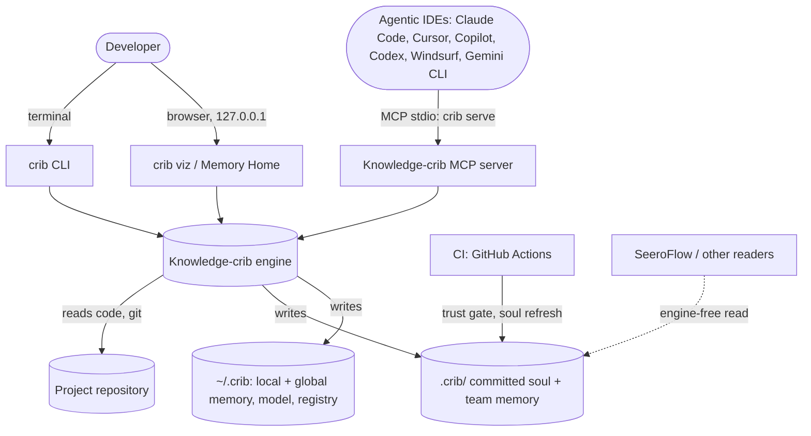
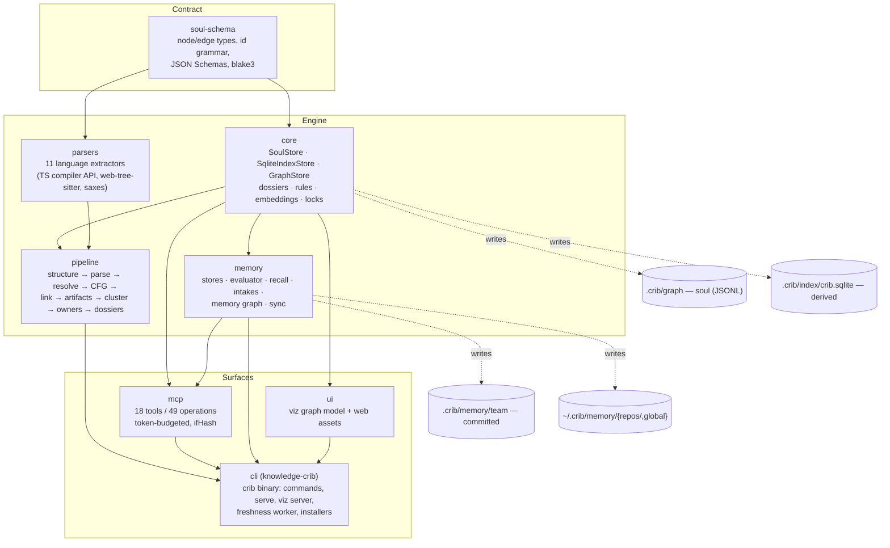
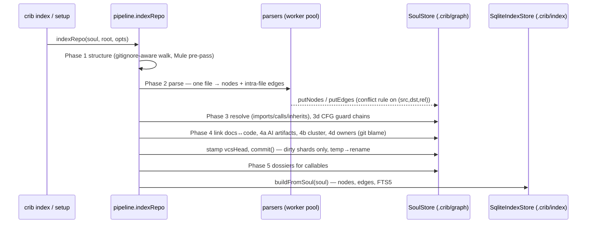
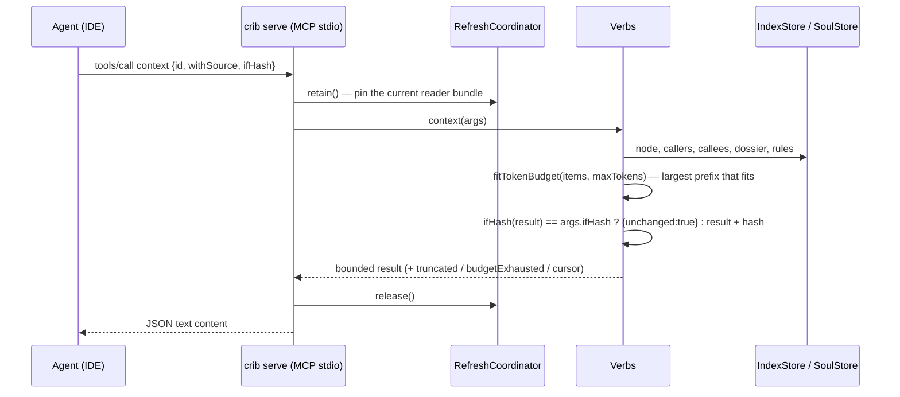
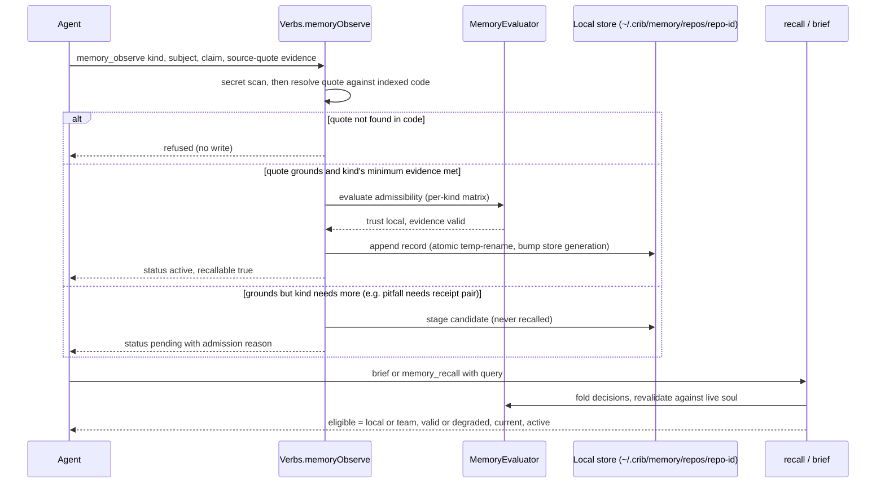
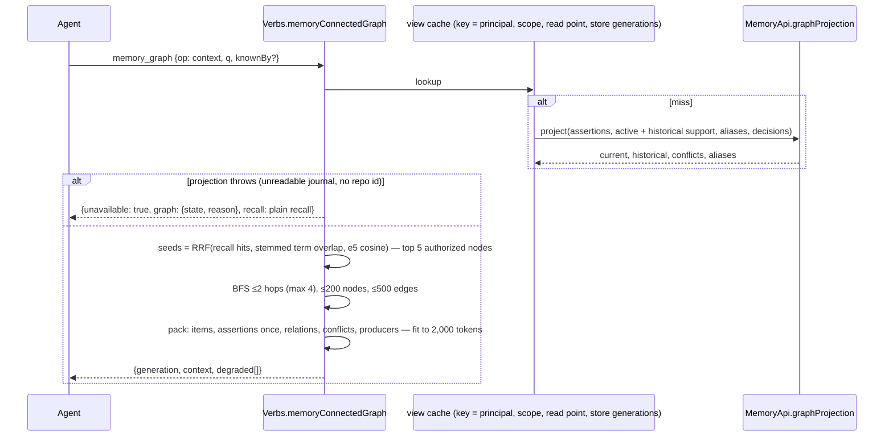
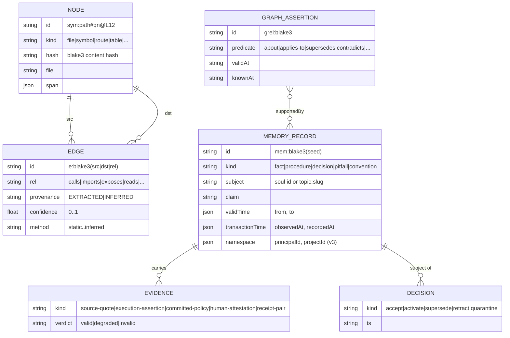

This document describes what Knowledge-crib is, how its parts fit together, and why it is shaped the way it is. It is written for an architect or senior engineer deciding whether the design is sound, where it will bend, and what it deliberately does not do. It describes the system **as built** at commit `034c3853`; where the older design documents in `docs/` disagree with the code, this document follows the code and says so. The companion [LLD](02-lld.md) goes one level down, package by package, with code.

# 1. Context

## 1.1 The problem

AI coding agents (Claude Code, Cursor, Copilot, Codex, Windsurf, Gemini) start every session knowing nothing about the repository they are in, and forget everything when the session ends. They rebuild understanding by reading files, which is slow, expensive in tokens, and shallow: a model that reads ten lines of a change and guesses the rest is doing arithmetic, not being lazy. Measured on this repository, reviewing one real commit by reading every touched file costs ~212,000 tokens; the same review through crib's `review` verb costs ~2,000 (`docs/bench/review-cost.md`).

Knowledge-crib gives every agent, in every IDE, two things it otherwise lacks:

1. **A code graph** — a deterministic, committed model of the repository (symbols, calls, imports, routes, tables, docs, owners) that agents query instead of reading files.
2. **A memory** — durable, evidence-backed claims, work-in-progress intakes, and a temporal memory graph that survive the session, are shared across IDEs, and are never trusted just because an agent said so.

## 1.2 Users and boundary

| Actor | What they do with crib |
|---|---|
| Developer | Runs `crib setup` / `crib index` once; browses `crib viz`; reads the terminal and the memory home. |
| AI agent (in an IDE) | Calls MCP tools (`query`, `context`, `impact`, `review`, `brief`, `memory`, `memory_graph`, …) over stdio. |
| CI | Runs `crib-memory.yml` (team-memory trust), `crib-soul-refresh.yml`, release gates. |
| Other tools (e.g. SeeroFlow) | Read the committed soul files directly — no engine required. |

**Inside the boundary:** indexing, the soul and its derived index, the MCP server, the CLI, the viz/memory web UI, the memory stores and their evaluation, the on-device embedding tier, the freshness worker, launch/certification tooling.

**Explicitly out of scope:** hosted multi-tenant service; any model call on the deterministic query path; bundled LLM provider keys; production cross-device sync (sync ships as preview, `docs/memory-sync.md`); external business connectors.

Figure 1 shows the central fact of the design: every surface — CLI, MCP, web UI — is a thin client of one engine, and the engine's durable state is plain files in two places: committed under `.crib/` (shared with the team through git) and user-owned under `~/.crib/` (never committed).

# 2. Drivers and constraints

| Driver / constraint | Consequence in the design |
|---|---|
| Must work in **every** agentic IDE, not one vendor's | MCP over stdio as the primary interface; a vendor-neutral instruction block installed into each client's instruction file (`packages/cli/src/adapters.ts`). |
| Agents are **untrusted producers** | Memory is never admitted on an agent's say-so: every claim needs admissible evidence re-checked by an independent evaluator (`packages/memory/src/evaluator.ts`). |
| Offline and free on the query path | Parse, graph, search, impact and recall never call a network or model. Semantic ranking uses a pinned, integrity-verified on-device model (`multilingual-e5-large`), loaded from `~/.crib/embed/manifest.json`. |
| Reviewable in git | The soul is sharded, sorted JSONL: a one-file edit touches one shard; unchanged source re-indexes byte-identically (the determinism gate). |
| Zero commit tax | The post-commit hook only enqueues a small file; all refresh work runs in a background worker (`packages/cli/src/freshness.ts`). |
| Node 22.5+, single runtime | `engines: node >=22.5.0` for built-in `node:sqlite`; no native bindings to install (`packages/core/src/index/sqlite-index.ts`). |
| Solo-maintained, agent-built codebase | Laws are enforced by tests and gates, not convention: capability manifest checks, docs-stats drift gates, determinism gates, launch receipts. |

# 3. Architecture overview (containers)

Knowledge-crib is a pnpm monorepo of eight packages. They are libraries composed into one executable (`crib`); at runtime there is one process per surface (an MCP server per IDE session, a viz server, a freshness worker), all sharing the same on-disk state under locks.

| Container | Responsibility | Technology | Why separate |
|---|---|---|---|
| `soul-schema` | The closed vocabulary: `NodeKind`, `Rel`, `Method`, `Provenance`; the id grammar (`sym:<path>#<qn>@L<n>`, `e:<blake3(src,dst,rel)>`); vendored JSON Schemas; `SCHEMA_VERSION = '1.6'`. | TypeScript, `@noble/hashes` | Only dependency-free package, so an external reader can validate a soul without pulling the engine. |
| `parsers` | One extractor per language turning **one file** into nodes + intra-file edges. Languages: agent, csharp, go, java, md, mule, php, plsql, python, rust, ts (`docs/STATS.md`). | TS compiler API, `web-tree-sitter` WASM grammars, `saxes`, `yaml` | Extractors are a plugin contract (`packages/parsers/src/types.ts`) and never do cross-file work, so they parallelise in worker threads. |
| `core` | Durable graph storage (SoulStore), the derived search/traversal index (IndexStore over `node:sqlite` + FTS5), working-tree overlay, dossiers, decision tables, rename planning, embedding tier, cross-process locks. | TypeScript, `node:sqlite`, `ajv` | Everything that reads or writes the graph goes through here; nothing above it touches files directly. |
| `pipeline` | Orchestrates indexing: full (`indexRepo`) and incremental (`updateRepo`), resolvers per language, CFG guard chains, cross-modal linker, clustering, `git blame` ownership, AI-artifact graph, multimodal ingest. | TypeScript, `yauzl`, `unpdf`, worker threads | Owns write ordering to the soul; the only writer of extracted graph data. |
| `memory` | Agent memory: three stores (team/local/global), record schemas v1–v3, the four-axis evaluator, recall ranking, intakes and handoff, pending-capture admission, the temporal memory graph, backup, encrypted sync. | TypeScript, `ajv` | Memory has its own trust model and lifecycle; it depends on `core` but `core` never depends on it. |
| `mcp` | The agent interface: registers tools from one capability manifest, enforces token budgets, `ifHash` short-circuits, reader-generation pins, secret scanning of enrichment. | `@modelcontextprotocol/sdk`, `zod` | One verb implementation (`Verbs`) serves MCP, CLI and HTTP. |
| `ui` | Builds the client-side graph snapshot and ships the no-build web app (`packages/ui/web/index.html`). | TypeScript + vanilla template engine | Keeps the browser bundle out of the CLI package. |
| `cli` | The `crib` binary: every command, `crib serve` (stdio/HTTP), the viz/memory HTTP server, the freshness worker and service, IDE installers, hooks, doctor. | TypeScript | The composition root and the only package that knows about the user's machine. |

# 4. Key flows

## 4.1 Indexing a repository

Figure 3's ordering is the core invariant: **everything lands in the soul before anything is indexed**, and the index is only ever built from the soul. There is no path that writes the index from extraction output, so the two cannot drift. Incremental `crib update` repeats the same phases for the changed files plus their reverse-dependency closure, then applies the delta; with no git anchor it returns `null` and the caller falls back to a full index (`packages/pipeline/src/update.ts`).

## 4.2 An agent answers a question

Two properties matter here. First, a request is pinned to one published reader generation for its whole duration (`RequestPins.retain/release`, `packages/mcp/src/server.ts`), so a refresh that publishes mid-request cannot mix old and new data inside one answer. Second, every list is cut to a token budget by a binary search over prefixes (`fitTokenBudget`, `packages/mcp/src/token-budget.ts`), and the response says it was cut; an agent can pass the previous `hash` back as `ifHash` and receive `{unchanged:true}` instead of the body.

## 4.3 Memory: observe → admit → recall

Figure 5 is the trust model in one picture: the only way into recall is evidence the server can verify itself. A kind with a higher bar (a `pitfall` needs a failing+passing receipt pair) is staged, visible to an explicit `includePending` read but never to normal recall. The failure path — a quote not in the code — writes nothing.

## 4.4 Connected memory graph retrieval, including the degraded path

The degraded path in Figure 6 is deliberate: a graph that cannot be read is reported as `unavailable: true` with plain recall attached, never dressed up as an empty graph answer.

# 5. Data architecture

| Data | Owner (writer) | Location | Committed? | Lifetime |
|---|---|---|---|---|
| Extracted graph (soul) | `pipeline` via `SoulStore` | `.crib/graph/extracted/{nodes,edges,clusters}` + `manifest.json` | Yes | Rewritten per shard on change |
| Authored semantic layer (agent-written analysis) | `mcp` `enrich save` via `EnrichmentStore` | `.crib/graph/semantic/artifacts` | Yes | Pruned when its target node disappears |
| Derived index | `SqliteIndexStore.buildFromSoul/applyDelta` | `.crib/index/crib.sqlite` | No (gitignored) | Rebuildable any time |
| Dossiers | `pipeline` Phase 5 | `.crib/dossiers/` | Yes | Rebuilt on hash/schema/shape staleness |
| Team memory | CLI/CI promotion only (`crib memory propose`) | `.crib/memory/team` + `policy.json` | Yes | Append-only; retraction is a decision, never a deletion |
| Local memory (per repo) | MCP/CLI | `~/.crib/memory/repos/<repoId>` | No | Retention policy; purge removes physically |
| Global memory | MCP/CLI | `~/.crib/memory/global` | No | Same as local |
| Intelligence events | `memory` | `.crib/intelligence/intelligence-events.jsonl` | Yes | Append-only journal |
| Embedding model | `crib embed setup` | `~/.crib/embed/` (pinned manifest + ONNX weights) | No | Integrity-checked on load |
| Freshness queue, registry | `cli` | `~/.crib/registry.json`, `~/.crib/freshness/` | No | Durable queue with leases |

Figure 7 separates two models that must not be confused. The **code graph** is extracted fact, deterministic and replaceable by re-indexing. The **memory ledger** is asserted knowledge whose trust is computed, never stored as truth: a record's effective verdicts are folded at read time from its stamped verdicts, its evidence (revalidated against the live soul), and the append-only decision events about it. A memory graph assertion is trusted only while at least one record or intake that supports it is still active and visible to the caller.

# 6. Cross-cutting concerns

**Identity and authorization.** There is no network authentication: the MCP server runs as a child of the user's IDE over stdio, and the viz server binds `127.0.0.1` and rejects any `Host` header that is not loopback (DNS-rebinding guard, `packages/cli/src/viz-server.ts`). Inside memory, the *principal* (`KCRIB_PRINCIPAL_ID`, default `principal:local`) is server-derived and scopes every read: memory-2/3 records, intakes, graph assertions and graph resolution decisions are filtered by `namespace.principalId === caller` before any ranking, traversal, count or cursor. Browser mutations need a per-run CSRF grant fetched same-origin and sent as a header.

**Secrets.** Every memory write and every authored enrichment artifact passes a secret scanner (`packages/memory/src/secrets.ts`, `packages/mcp/src/secrets.ts`); gitignore-aware discovery keeps `.env` and similar out of the soul (`packages/pipeline/src/gitignore.ts`). Sync encrypts every event with AES-256-GCM before it leaves the device (`packages/memory/src/sync/crypto.ts`).

**Idempotency and atomicity.** Every id is content-addressed (blake3), so re-submitting identical content is a no-op: soul nodes and edges, memory records (`mem:`), decisions (`dec:`), graph assertions (`grel:`), extraction jobs (`gjob:`). Every file write is temp→rename. Cross-process writers take `CribLock` (O_EXCL lockfile with pid liveness and stale reclaim, `packages/core/src/lock.ts`).

**Freshness.** Three modes per project in `~/.crib/registry.json`: `manual` (default), `watch` (in-memory working-tree overlay while a server runs; `.crib/graph` is never dirtied), `auto` (durable background worker after each commit). A refresh publishes a new reader generation atomically; a failed refresh never publishes, so the last good generation stays readable.

**Observability.** `status` (health, freshness, generation, index staleness), `status {op:'stats'}` (per-tool calls, cache hit rate), `crib doctor` (14 setup checks), and the viz server's `/memory/home.json` health block. There is no remote telemetry.

**Configuration.** Almost none by design: `crib.json` manifest (repo id, schema version, capabilities), `.crib/memory/policy.json` (trusted ref and gate profiles), `~/.crib/registry.json` (freshness mode), environment variables (`KCRIB_MEMORY_DIR`, `KCRIB_PRINCIPAL_ID`, `KCRIB_EMBED_HOME`).

# 7. Non-functional requirements

Only measured numbers are stated as met; everything else is marked.

| Attribute | Target | How the design meets it | Measured (source) |
|---|---|---|---|
| Review cost | order-of-magnitude below file reading | `review` verb composes diff + callers + prior decisions in one bounded call | ~2,000 vs ~212,000 tokens (`docs/bench/review-cost.md`) |
| Warm recall p95 @ 10k records | < 100 ms | persistent FTS snapshot, generation-keyed verdict cache | 8.3 ms (`docs/bench/perf-gates.md`, 5 Sep 2026) |
| Warm recall p95 @ 100k records | < 300 ms | same | 132.8 ms (same) |
| Memory graph warm read p95 @ 100k assertions | ≤ 500 ms | view cache keyed by store generations; memoized generation digest | 78 ms (`~/crib-launch-evidence/2026-09-17-graph/graph-bench-100k.json`) |
| Memory graph context assembly p95 @ 100k | ≤ 1 s (no model) | cached view + bounded BFS + compact pack | 420 ms (same) |
| Single assertion visible p95 | ≤ 2 s | generation miss → reprojection | 1.26 s (same) |
| Commit tax | 0 ms blocking | post-commit hook only enqueues | 0 ms (`docs/bench/perf-gates.md`) |
| Semantic recall quality | G2 paraphrase recall@5 ≥ 80%, G3 MRR ≥ 0.75 | e5-large semantic-only ranker when installed | G3 88.1% (`docs/bench/launch-gates.md`); G2 0.810 (same) |
| Connected retrieval quality | ≥ 90% evidence-path recall, held out | graph-seed-v2 + bounded expansion | **86.94% — not met** (`docs/bench/graph-gates.md`, run 2) |
| Foreign-principal disclosure | 0 | principal filter before traversal/rank/count | 0 on both graph corpora (same) |
| Index scale | not yet stated as a target | worker-pool parse, sharded soul | 10.6 s @ 10.5k LOC, 185 s @ 50.9k LOC, 678 MB peak (`docs/bench/scale-curve.md`) — see R1 |
| One-file watch update → queryable | < 5 s p95 | watch overlay | Not measured as an E2E gate (`docs/bench/perf-gates.md`) |

# 8. Design decisions

**D1 — Soul (committed JSONL) as truth, SQLite index as a disposable cache.** The alternative was a single embedded graph database (LadybugDB was the original plan, `docs/knowledge-crib-decisions.md` Q9). The dual store won because it makes project knowledge reviewable and mergeable in git, readable without the engine, and rebuildable after corruption; a custom git merge driver (`crib merge-driver`) applies the same edge conflict rule as the writer. The cost is double storage and a rebuild step, and no Cypher: traversal is SQL over `edges(src)`/`edges(dst)` indexes. LadybugDB never shipped; `node:sqlite` removed native-binding install risk.

**D2 — Deterministic core; the host agent authors meaning.** The alternative was a bundled LLM (or MCP sampling) enriching the graph at index time. Instead the MCP server never calls a model: `enrich next` hands the agent a grounded work batch and `enrich save` accepts its analysis only if quotes overlap the real source and no secret is present. This keeps indexing free, offline and reproducible, and keeps every IDE's own model as the author. The cost is that semantic depth depends on agents doing the enrichment work; coverage must be tracked (`enrich status`, `audit-llm`).

**D3 — Memory trust is computed from evidence, never asserted.** The alternative — trust what the agent records, as most agent-memory products do — is simpler and faster to fill. It was rejected because an agent's own claim is not evidence, and a stale memory silently misleads every later session. The cost is friction: some true observations stay pending until a receipt or human attestation exists, and memory-2/3 records do not enter plain recall without a trust decision.

**D4 — One MCP server with op dispatchers and a single capability manifest.** 31 separate tools cost ~6,249 tokens of tool-list per session; consolidating into 18 tools / 49 operations behind `op` dispatchers, generated from `packages/mcp/src/capabilities.ts`, cut that by 42% and made the counts checkable (`scripts/capabilities-check.mjs`). The cost is a slightly less discoverable surface for agents, mitigated by the installed protocol text.

**D5 — The memory graph is a projection over journals, not a graph database.** Graph assertions are appended to the memory stores; the authorized temporal view is computed per read (and cached per store generation). The alternative, a persistent graph store, would need its own authorization, retention and tombstone logic duplicated from the ledger. The cost is reprojection time after every write (1.26 s p95 visibility at 100k assertions).

**D6 — Principal isolation enforced at the gather point.** Every memory read path funnels through the store gather that filters by principal before ranking, so a new verb inherits the boundary instead of re-deriving it. Legacy memory-1 records carry no principal stamp and are visible to any principal — the reason `crib doctor` flags unstamped records (R3).

# 9. Risks and open questions

| # | Risk / question | Impact | Mitigation or owner |
|---|---|---|---|
| R1 | Index time grows super-linearly in the only published curve (4.8× LOC → 17× wall time, 10.5k → 50.9k LOC); no 100k+ LOC data point on the current build. | Large monorepos may take tens of minutes to index. | Owner: maintainer. Re-run `scripts/scale-bench.mjs` at 100k/500k LOC on HEAD before any scale claim; profile resolve and link phases first. |
| R2 | Connected retrieval misses its launch gate on held-out data (86.94% vs 90%); corpus v2 is spent. | Graph launch requirement is NO-GO. | Owner: maintainer. Decide decoy semantics for a principal's own global claims; author corpus v3 independently before any retrieval change. |
| R3 | Memory-1 records (38 in this repo's stores) have no principal stamp. | If stores of two principals are ever gathered together, the boundary cannot exclude them. | `crib memory migrate`; pass `strictPrincipal` on multi-principal gathers. Needs an owner decision on migrating live stores. |
| R4 | Vendor client certification: all 21 client/platform cells are uncertified. | Cross-IDE claims rest on configuration, not runtime proof, except Claude Code on macOS runtime evidence. | Requires signed-in vendor clients on native macOS/Linux/Windows hosts running `scripts/client-certify.mjs`. |
| R5 | `SqliteIndexStore` can build vectors and run RRF hybrid search when constructed with an embedder, but the shipped factory constructs it without one (`packages/core/src/index/factory.ts:19`), so code search is BM25 + synonyms + reranking; the e5 model serves memory recall and memory-graph seeds only. | Paraphrase search over *code* is weaker than over memory. | Open question (maintainer): wire the installed embedder into `openIndex`, measuring index-time cost first. |
| R6 | The crib MCP server keeps a loaded index for the session; after `crib update`, a running server can reject evidence for files it has not reloaded. | A `memory_observe` call can fail until the IDE restarts the server. | Reader-generation adoption covers the graph; memory evidence resolution should adopt the same generation. |
