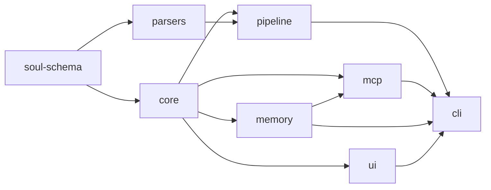
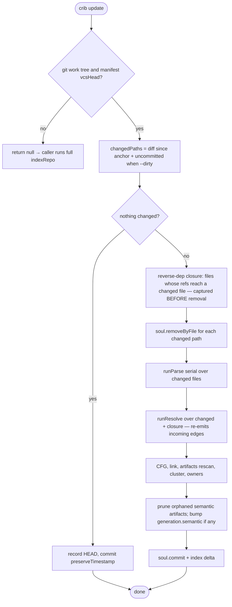
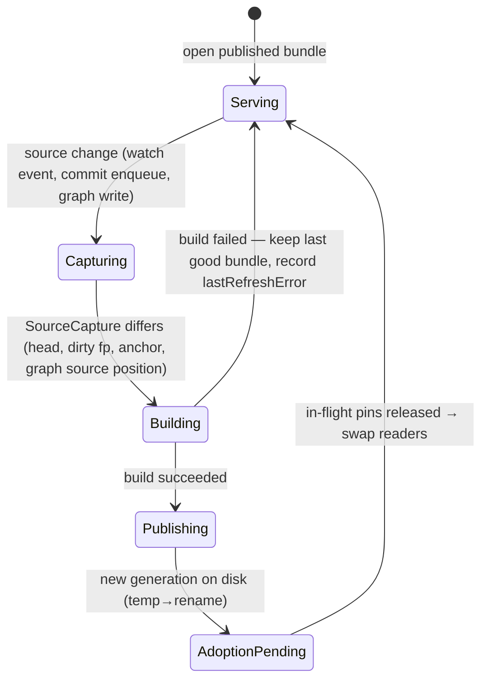

This document is for whoever changes Knowledge-crib's internals, or debugs them at 2am months from now. It goes package by package through what each one owns, the interfaces that cross its boundary, the rules its core logic enforces (with the code that enforces them), and how it fails. It assumes you have read the [HLD](01-hld.md). Small packages share a section; every code excerpt is from the tree at commit `034c3853` and names its file, so when an excerpt and the file disagree, the file is right and this document is stale.

# 1. Package map and dependency rule



The rule Figure 1 encodes: **dependencies only point toward the contract**. `core` never imports `memory`, `pipeline` or `mcp`; `memory` never imports `mcp` (the evaluator re-implements quote grounding in `packages/memory/src/grounding.ts` rather than import it); only `cli` sees every package. TypeScript project references (`tsconfig.json` `references` per package) make a backwards import a compile error, and `pnpm verify` builds every package before testing.

# 2. `soul-schema` — the contract

## 2.1 Purpose and boundary

The closed vocabulary every other package speaks: node kinds, relations, the id grammar, content hashing, and the vendored JSON Schemas written into every soul. It owns no I/O. It deliberately does not hold parser or memory contracts, so an external reader (SeeroFlow) can validate a soul with one dependency (`@noble/hashes`).

## 2.2 Interfaces

| Export | What it is |
|---|---|
| `NodeKind`, `NODE_KINDS` | 21 kinds: `file`, `symbol`, `doc-section`, `media-seg`, `explanation`, `cluster`, `table`, `column`, `statement`, `condition`, `exception-handler`, `raise`, `cursor`, `assignment`, `case-branch`, `route`, `field`, `component`, `owner`, `http-call`, `agent-artifact` — `packages/soul-schema/src/enums.ts` |
| `Rel` | `calls`, `imports`, `inherits`, `implements`, `describes`, `references`, `derived-from`, `member-of`, `executes`, `reads`, `writes`, `guarded-by`, `raises`, `handles`, `iterates`, `declares`, `exposes`, `injects`, `renders`, `produces`, `owned-by`, `governs`, `requires`, `invokes` |
| `Method` / `Provenance` | `static < explicit < identifier < path < semantic < inferred` (rank order) / `EXTRACTED` or `INFERRED` |
| `idFor(spec)` | the only way ids are built — `packages/soul-schema/src/id.ts` |
| `blake3Hex`, `SCHEMA_VERSION = '1.6'`, `SUPPORTED_SCHEMA_VERSIONS` | hashing and version gate |

## 2.3 Data: the id grammar

Ids are reproducible from source, so they drive stable git diffs and the edge conflict collapse:

| Kind | Id |
|---|---|
| file | `file:<path>` |
| symbol | `sym:<path>#<qualifiedName>@L<startLine>` |
| doc-section | `doc:<path>#<anchor>` |
| statement / condition | `stmt:<file>@L<line>` / `cond:<file>@L<line>` |
| table / column | `table:<schema.NAME>` / `col:<schema.TABLE.COL>` |
| route | `route:` prefix from `{httpMethod, routePath, file, line}` |
| agent-artifact | `art:<path>#<name>` |
| edge | `e:<blake3(src,dst,rel)>` — two edges with the same endpoints and relation *are* the same id |

A symbol id embeds its start line, so moving a function changes its id. That is intentional (the diff shows the move); memory survives it through locator-based reattachment (§6.5), not through stable symbol ids.

## 2.4 Extension points

A new node kind or relation is a schema-version bump: add it to the union and the `NODE_KINDS`/`RELS` arrays, add its id grammar to `idFor`, bump `SCHEMA_VERSION` and `SUPPORTED_SCHEMA_VERSIONS`, and regenerate the vendored schema. Unknown values fail validation by design (invariant #4), so an old engine refuses a newer soul instead of silently dropping data.

# 3. `core` — graph storage, index, and shared engines

## 3.1 Purpose and boundary

Owns every read and write of graph data: `SoulStore` (truth), `SqliteIndexStore` (derived), `GraphStore` (the read facade over canonical + working overlay), the edge conflict rule, the `.crib` merge driver logic, dossiers, decision tables (`rules/`), rename planning, the embedding tier, `ifHash`, and `CribLock`. It does **not** extract, resolve, or know about memory.

## 3.2 Internal structure

| Module | Responsibility |
|---|---|
| `soul-store.ts` | in-memory Maps + sharded JSONL persistence; `putNodes/putEdges/removeByFile/commit` |
| `conflict-rule.ts` | `resolveEdgeConflict(a, b)` — the single rule shared by the writer and the git merge driver |
| `shard.ts`, `graph-layout.ts` | shard key from source path; `.crib/graph/{extracted,semantic}` layout |
| `index/sqlite-index.ts`, `index/factory.ts` | the `IndexStore` implementation over `node:sqlite` + FTS5; `openIndex` |
| `index/rerank.ts`, `index/synonyms.ts` | query-time synonym expansion and reranking |
| `graph-store.ts`, `working-overlay.ts` | canonical vs ephemeral overlay composition for `serve --watch` |
| `dossier/*` | per-callable deep artifacts; `framework.ts` (routes/DI/relations); `persist.ts` staleness |
| `rules/*` | decision-table extraction over CFG guard chains |
| `rename.ts` | call-graph rename plan with deterministic `planId`, all-or-nothing apply |
| `embeddings/*` | char-ngram embedder, installed-model tier (`embed-install.ts`), remote tier policy |
| `lock.ts` | `CribLock` cross-process advisory lock |
| `ifhash.ts` | `ifHash(value) = contentHash(canonicalStringify(value))` |

## 3.3 Data: soul on disk and the SQLite index

The soul lives under `.crib/graph/`:

```
.crib/graph/manifest.json            repo id, schemaVersion, stats, vcsHead, generation{extracted,semantic}
.crib/graph/extracted/nodes/<shard>/<chunk>.jsonl
.crib/graph/extracted/edges/<shard>/<chunk>.jsonl
.crib/graph/extracted/clusters/clusters.jsonl
.crib/graph/semantic/artifacts/…      agent-authored analysis (enrich save)
.crib/graph/semantic/{aliases,state}.json
```

Records are sorted by id within each chunk, so an unchanged source re-indexes byte-identically. The derived index schema (`packages/core/src/index/sqlite-index.ts`, `createSchema`):

```sql
CREATE TABLE IF NOT EXISTS nodes (id TEXT PRIMARY KEY, kind TEXT NOT NULL, name TEXT, file TEXT, json TEXT NOT NULL);
CREATE TABLE IF NOT EXISTS edges (id TEXT PRIMARY KEY, src TEXT NOT NULL, dst TEXT NOT NULL, rel TEXT NOT NULL,
                                  provenance TEXT NOT NULL, confidence REAL NOT NULL, json TEXT NOT NULL);
CREATE INDEX IF NOT EXISTS idx_edges_src ON edges(src);   -- impact down / callees
CREATE INDEX IF NOT EXISTS idx_edges_dst ON edges(dst);   -- impact up / callers
CREATE VIRTUAL TABLE IF NOT EXISTS nodes_fts USING fts5(id UNINDEXED, name, qualifiedName, signature, heading, file, body);
CREATE TABLE IF NOT EXISTS vectors (id TEXT PRIMARY KEY, vec BLOB NOT NULL, dim INTEGER NOT NULL);
CREATE VIRTUAL TABLE IF NOT EXISTS semantic_fts USING fts5(targetId UNINDEXED, layer UNINDEXED, purpose, detail);
CREATE TABLE IF NOT EXISTS semantic_meta (k TEXT PRIMARY KEY, v TEXT NOT NULL);
```

The two edge indexes are the whole traversal story: `impact up` walks `dst → src`, `impact down` walks `src → dst`, breadth-first with a depth and limit. `semantic_fts` is separate from `nodes_fts` because authored prose changes on every `enrich save` while node text changes only when code does, so it has its own generation counter (`manifest.generation.semantic`).

## 3.4 Core logic

**Edge conflicts.** Two extractions of the same `(src, dst, rel)` share an id; one survives, deterministically, whatever order they arrive in (`packages/core/src/conflict-rule.ts`):

```ts
export function resolveEdgeConflict(a: Edge, b: Edge): Edge {
  const aExtracted = a.provenance === 'EXTRACTED';
  const bExtracted = b.provenance === 'EXTRACTED';
  if (aExtracted !== bExtracted) return aExtracted ? a : b;          // 1. EXTRACTED beats INFERRED
  if (a.confidence !== b.confidence) return a.confidence > b.confidence ? a : b; // 2. confidence
  const ra = METHOD_RANK[a.method];
  const rb = METHOD_RANK[b.method];
  if (ra !== rb) return ra < rb ? a : b;                             // 3. stronger method
  const winner = a.id <= b.id ? a : b;                               // 4. merge evidence, lowest id
  ...
}
```

The same function runs inside `crib merge-driver`, so a git merge of two branches' `.crib` shards reaches the same result the writer would.

**Commit.** Only dirty shards are rewritten, and the extracted generation advances only if the graph actually changed (`SoulStore.commit`):

```ts
commit(now = new Date().toISOString(), preserveTimestamp = false): void {
  if (this.ephemeral) return;                      // watch overlay can never dirty .crib/graph
  const graphChanged = this.dirtyNodeShards.size > 0 || this.dirtyEdgeShards.size > 0 || this.clustersDirty;
  this.pruneDangling();
  ...
  for (const shard of this.dirtyNodeShards) this.writeNodeShard(shard);
  this.writeClusters();
  for (const shard of this.dirtyEdgeShards) this.writeEdgeShard(shard);
  this.refreshStats(now, preserveTimestamp);
  if (this.canonicalLayout && graphChanged) {
    const generation = this.manifest.generation ?? { extracted: 0, semantic: 0 };
    this.manifest.generation = { ...generation, extracted: generation.extracted + 1 };
  }
  this.writeManifest();
  ...
}
```

**Memory model.** `SoulStore.load()` hydrates the whole graph into Maps (`packages/core/src/soul-store.ts` header). This is why indexing is fast at 10k-file scale and why peak RSS grows with the repository (678 MB at 50.9k LOC, `docs/bench/scale-curve.md`). The older storage doc's "streaming, no full load" interface does not describe the shipped store.

**Locking.** `CribLock.acquire()` creates the lockfile with O_EXCL; on failure it classifies the holder as live (throws `LockBusyError`), stale (steals only if the file still carries the exact pid+mtime it judged), or vanished (re-races the create, never unlinks):

```ts
for (let attempt = 0; attempt < ACQUIRE_RACE_ATTEMPTS; attempt += 1) {
  if (this.tryCreate(this.path)) { this.held = true; return; }
  const verdict = this.staleness();
  if (verdict.kind === 'vanished') continue;       // re-race the create; never unlink
  if (verdict.kind === 'live') throw new LockBusyError(verdict.holderPid, `crib is busy: ...`);
  if (this.steal(verdict.holderPid, verdict.mtimeMs)) { this.held = true; return; }
}
```

The "never unlink when vanished" branch is load-bearing: an earlier version unlinked there, and two contenders in the same release window each deleted the other's fresh lock and both entered the critical section (~1.5% of runs under test).

## 3.5 Failure behaviour

| Failure | Detection | What happens |
|---|---|---|
| Invalid node/edge (unknown kind, bad id) | `assertValidNode/Edge` against the vendored schema on `putNodes/putEdges` | throws; nothing is written for that batch |
| Crash mid-commit | shard files are written temp→rename | each shard is old or new, never torn; a manifest written last may lag one commit, and the next `crib update` re-derives |
| Lock held by a live process | `LockBusyError` with holder pid | CLI prints the message and exits `EXIT.LOCKED` (4) |
| Lock held by a crashed process | mtime older than `DEFAULT_LOCK_STALE_MS` (10 min) and pid not alive | stolen atomically on next acquire |
| Missing or stale derived index at `crib serve` | `openIndexForServe` | serves stale with a warning, or rebuilds from the soul under lock; never exits (an exit drops the IDE's stdio connection) |
| Dossier from an older shape | `readDossier`: `stale = hashStale ‖ schemaStale ‖ shapeStale` | rebuilt on demand |

## 3.6 Configuration

| Setting | Where | Default | Effect |
|---|---|---|---|
| `manifest.stores.index.backend` | `.crib/graph/manifest.json` | `sqlite` | selects `openIndex` backend (`kuzu-index.ts` exists, not default) |
| `chunking.shardHexDigits` / `chunking.maxChunkLines` | manifest, seeded from `DEFAULT_CHUNKING` (`packages/soul-schema/src/types.ts`) | 2 (256 shards) / 5,000 | diff granularity and chunk size |
| `DEFAULT_LINK_THRESHOLD` | `conflict-rule.ts` | 0.4 | edges below this confidence are not persisted |
| `DEFAULT_LOCK_STALE_MS` | `lock.ts` | 600,000 ms | stale-lock reclaim age |

## 3.7 Extension points

A new index backend implements `IndexStore` and registers in `index/factory.ts`; nothing above `core` changes. A new dossier section goes in `dossier/builder.ts` + `serializer.ts`, and must bump `DOSSIER_SHAPE_VERSION` so persisted dossiers rebuild.

# 4. `parsers` — extractor plugins

## 4.1 Purpose and boundary

Turns **one file** into nodes and **intra-file** edges. Cross-file resolution is not a parser's job; extractors never call a model and must degrade to a bare `file` node on parse failure.

## 4.2 Interface

```ts
// packages/parsers/src/types.ts
export interface Extractor {
  name: string;                                   // "lang:typescript", "doc:markdown"
  supports(file: FileMeta): boolean;              // first registered match wins (registry.ts)
  capabilities?: Capabilities;                    // {imports, calls, inheritance, types}
  extract(file: FileMeta, ctx: ExtractCtx): Promise<ExtractResult>;
}
export interface ExtractCtx {
  readText(): Promise<string>;
  treeSitter(grammar: string): ParserHandle;      // shared WASM parser pool
  hash(s: string): string;                        // "blake3:<hex>"
  idFor(kind: NodeKind, parts: Record<string, unknown>): string;
}
```

Languages at HEAD: agent, csharp, go, java, md, mule, php, plsql, python, rust, ts (`docs/STATS.md`). Framework layers ride inside language extractors as later passes: Spring (`parsers/src/java/spring.ts`), React/NestJS/Express (`parsers/src/ts/react.ts`, `nest.ts`, `express.ts`), emitting `route`/`field`/`component` nodes and `exposes`/`injects`/`renders`/`produces`/`references` edges.

## 4.3 Core logic worth knowing

`EXPR_MAX_CHARS = 2000` with `clampExpr` bounds every captured expression (conditions, cursor queries, assignment right-hand sides) and stamps `exprTruncated` when hit, so a decision table is never silently clipped. The limit was raised from 120/200 because migration plans built from the graph lost formula detail a direct source read kept.

## 4.4 Failure behaviour

A parse failure returns a `file` node plus a diagnostic (`ExtractResult.diagnostics`), aggregated by the parse phase in discovery order; one bad file never aborts an index. Known historical failure: the PL/SQL recoverer stalled on a stray `WHEN/ELSE/EXCEPTION` token and hung `crib index`; the guard `if (pos === before) pos++` in `recover()` is what prevents the infinite loop.

## 4.5 Testing notes and extension points

Every language has fixtures under `packages/parsers/fixtures/` and a parity suite (`pipeline/src/parity`) that checks the same construct extracts identically across languages. A new language: implement `Extractor`, register it in `defaultExtractors()`, add a resolver in `pipeline/src/resolve/` if it has imports/calls, and add fixtures plus a capability-honesty test that proves every `capabilities` flag it claims.

# 5. `pipeline` — indexing orchestration

## 5.1 Purpose and boundary

The only writer of extracted graph data. Owns phase ordering for full and incremental indexing, the worker pool, resolvers, CFG annotation, doc↔code linking, AI-artifact discovery, clustering, ownership, multimodal ingest and dossier generation.

## 5.2 Phases (full index, `indexRepo`)

| Phase | Function | Output |
|---|---|---|
| 1 structure | `runStructure` | `file` nodes; gitignore-aware walk (`gitignore.ts` layered over default ignores); Mule classification pre-pass |
| 2 parse (+3b markdown) | `runParse` | per-file nodes and intra-file edges; parallel worker pool only for the default registry |
| 3 resolve | `runResolve` | cross-file `imports`/`calls`/`inherits`/`implements` per language resolver |
| 3d CFG | `runCfg` | guard chains on edges: `guard`, `cfgPath`, `branch`, `inLoop`, `inException` |
| 3e multimodal (opt-in) | `runMultimodal` | `media-seg` nodes via the offline worker |
| 4 link | `runLink` | `describes`/`references` doc↔code |
| 4a artifacts | `runArtifactGraph` | `agent-artifact` nodes; `governs`/`requires`/`invokes` |
| 4b cluster | `runCluster` | Louvain communities → `cluster` nodes |
| 4c semantic (opt-in `--semantic`) | `runSemanticLink` | INFERRED TF-IDF `references` edges |
| 4d ownership | `runOwnership` | `owner` nodes + `owned-by` edges from `git blame` |
| commit | `soul.commit()` | shards + manifest; `vcsHead` stamped first |
| 5 dossiers | `runDossiers` | persisted per-callable dossiers |
| index | `index.buildFromSoul(soul)` | derived SQLite |

## 5.3 Incremental update (`updateRepo`)



Figure 2's closure step is the subtle one: if `a.ts` calls `b.ts` and only `b.ts` changes, removing `b.ts`'s nodes also drops the `a → b` edge. Re-resolving the closure re-emits it. Capturing the closure after removal would find no referrers and lose the edge silently.

## 5.4 Failure behaviour

| Failure | Behaviour |
|---|---|
| Not a git repo / no anchor | `updateRepo` returns `null`; full index |
| Extractor throws | file degrades to a `file` node; diagnostic aggregated |
| Worker pool crash | parse falls back to serial (custom registries always run serial) |
| `git blame` unavailable | ownership phase is a clean no-op |
| Multimodal backend missing (no whisper) | adapter reports unavailable; `crib doctor` shows it; the index proceeds |

## 5.5 Performance

`docs/bench/scale-curve.md`: 10,524 LOC in 10.6 s (551 nodes/s, 327 MB peak), 50,866 LOC in 185 s (153 nodes/s, 678 MB). Throughput falls as the repository grows, so the resolve and link phases are the first place to profile before any 100k-LOC claim (HLD R1). Incremental cost is proportional to the changed files plus their closure.

## 5.6 Extension points

A new phase goes between existing ones in `indexRepo` and must be replicated in `updateRepo`, writing disjoint edge source-kinds from its neighbours (Phase 3e and Phase 4 already rely on that disjointness). A new resolver registers in `resolve/resolver-registry.ts`.

# 6. `memory` — agent memory

## 6.1 Purpose and boundary

Durable, evidence-backed knowledge an agent can rely on across sessions and IDEs: records (claims), decisions about them, intakes (work in progress), pending captures, feedback, and the temporal memory graph. It computes trust; it never takes an agent's word for it. It does **not** extract code or call models.

## 6.2 Stores

| Role | Root | Collections | Written by |
|---|---|---|---|
| team | `<repo>/.crib/memory/team` (committed) | `records`, `decisions`, `receipts`, `intakes` | CLI/CI promotion only |
| local | `~/.crib/memory/repos/<repoId>` | `attempts`, `candidates`, `active`, `feedback`, `receipts`, `decisions`, `outbox`, `dead`, `intakes`, `graph`, `graph-jobs` | MCP + CLI |
| global | `~/.crib/memory/global` | `records`, `decisions`, `feedback`, `graph` | MCP + CLI |

`KCRIB_MEMORY_DIR` overrides `~/.crib/memory` (`packages/memory/src/paths.ts`). Each collection is sharded JSONL; every mutation is `writeJsonAtomic` (temp→rename, `packages/memory/src/atomic.ts`) under the store lock and then advances the store generation sidecar (`{gen, nonce}`), which every cache keys on.

## 6.3 Record schemas

Three record versions are live and readable together:

| Version | Identity seed | Notable fields |
|---|---|---|
| memory-1 | kind, subject, claim, scope, appliesTo, evidence, authorship | stamped `verdicts`, `createdAt` |
| memory-2 | kind, subject, propositionKey, claim, evidence | `validTime{from,to}`, `transactionTime{observedAt,recordedAt}`, `provenance`, `lineage{derivedFrom,supersedes,contradicts}`, `sensitivity`, `retentionPolicyId` |
| memory-3 | memory-2 seed **plus `namespace`** | `namespace{principalId, workspaceId?, projectId?, agentProfileId?}` |

memory-3 puts the namespace inside the id so a claim owned by two principals can never collapse into one syncable record, while time and provenance stay out of the seed so repeat observations still deduplicate (`packages/memory/src/ids.ts`, `memoryRecordV3Id`).

## 6.4 The four-axis verdict and admissibility

Every record has four independent verdicts, folded at read time (`packages/memory/src/enums.ts`, `evaluator.ts`):

| Axis | Values |
|---|---|
| trust | `candidate`, `local`, `team` |
| evidence | `valid`, `degraded`, `invalid` |
| applicability | `current`, `needs-review`, `orphaned` |
| lifecycle | `active`, `superseded`, `retracted` (+ `quarantined` flag) |

Which evidence counts depends on what is being claimed:

```ts
// packages/memory/src/evaluator.ts
const ADMISSIBLE: Record<MemoryRecordKind, EvidenceKind[]> = {
  fact:       ['source-quote', 'execution-assertion'],
  procedure:  ['source-quote', 'execution-assertion', 'committed-policy'],
  decision:   ['human-attestation', 'committed-policy'],
  convention: ['human-attestation', 'committed-policy'],
  pitfall:    ['receipt-pair', 'source-quote', 'human-attestation'],   // receipt-pair alone, or quote + attestation together
};
```

An agent's assertion is never evidence; a human cannot attest an implementation fact; an inadmissible item is `ignored`, not counted. Normal recall admits exactly:

```ts
export function isRecallEligible(v: EffectiveVerdicts): boolean {
  return (v.trust === 'local' || v.trust === 'team') &&
    (v.evidence === 'valid' || v.evidence === 'degraded') &&
    v.applicability === 'current' && v.lifecycle === 'active' && !v.quarantined;
}
```

**Pitfall to know:** for memory-2/3 records `effectiveVerdicts` takes trust from the migration alias snapshot or defaults to `candidate` (`trust: migratedVerdicts?.trust ?? 'candidate'`). A fresh v3 record is therefore never recall-eligible on its own; it needs an `activate`/`accept` decision. The memory graph does not depend on recall for this reason (§6.7).

## 6.5 Freshness: surviving refactors

Revalidation order for one evidence item: exact id + hash → stable reattachment by locator → require exactly one candidate → re-run quote/policy verification. Several candidates give `needs-review`; none gives `orphaned`/`invalid`. Reattachment changes **only the read projection**. Persisting a moved anchor creates a new immutable record plus a `supersede` decision; nothing is edited in place. `MemorySoulPort.findByLocator` materialises the node array once per generation and memoises locator matches, invalidating both when the generation moves.

## 6.6 Recall ranking

`recallProjection` (`packages/memory/src/recall.ts`) filters to eligible records, then sorts lexicographically, not by a weighted sum:

1. lexical relevance + exact subject/target match (FTS5, or e5-large semantic-only when installed)
2. repo team memory
3. repo local memory
4. explicit global memory
5. evidence quality (`valid` > `degraded`)
6. bounded feedback (±3, so one negative event cannot bury team memory)

then newest first. Local decisions overlay only local records ("no-poison"): a local retraction can never retire a team record.

## 6.7 The temporal memory graph

```mermaid
%% caption: Figure 3 — From journals to an answer: projection, seeds, expansion, pack
flowchart LR
  subgraph journals[Stores]
    ga[graph: grel/gent/gres]
    rec[records + decisions]
    ik[intakes + checkpoints]
  end
  journals --> proj[graphProjection — principal + scope filter, supported vs historical, aliases, conflicts]
  proj --> cache[(Verbs view cache: principal, scope, at, knownBy, store generations)]
  cache --> seeds[selectGraphSeeds + selectSemanticGraphSeeds + recall → fuseGraphSeeds RRF k=60]
  seeds --> bfs[expandFromSeeds BFS: hops 2 max 4, 200 nodes, 500 edges]
  bfs --> pack[buildGraphContextPack → fitTokenBudget 2000]
```



**Entries.** `GraphEntity` (`gent:`), `GraphAssertion` (`grel:`), `GraphResolutionDecision` (`gres:`, alias establish/reverse). Predicates: `about`, `applies-to`, `supported-by`, `derived-from`, `supersedes`, `contradicts`, `part-of`, `affects`. An assertion's id seeds `{predicate, subject, object, principalId, scope, validAt}`; `knownAt` and provenance are excluded, so resubmitting the same fact is idempotent.

**Projection laws** (`packages/memory/src/graph-projection.ts`, `MemoryApi.graphProjection`):

- Visible only if `namespace.principalId === viewer` and the scope is the viewer's repo or global.
- An assertion is *current* while at least one supporter is an active record, an open intake, or an owned entity. It is *historical* when its only supporters are superseded records or finished (completed/cancelled) intakes. With no live or historical supporter it is excluded and reported in owner-only `diagnostics.unsupported`.
- `knownBy` applies only supersessions and completions recorded by then; retraction and quarantine apply at every read point. An edge is not known before both of its record endpoints were recorded.
- Conflicts are functional predicates (`about`, `part-of`) with distinct objects, or explicit `contradicts` pairs; several objects of a multi-valued predicate are several facts.
- Alias decisions fold in `(ts, id)` order; an establish that would close a cycle is rejected, as is a reverse without a matching establish.

**Seeds and expansion.** Explicit refs must be nodes of the authorized view or come back as `unresolvedRefs`. Without refs, three ranked channels are fused by rank only:

```ts
// packages/memory/src/graph-retrieval.ts
export function fuseGraphSeeds(channels: readonly GraphSeed[][], opts = {}): GraphSeed[] {
  const fused = new Map<string, { score: number; bestRank: number; channel: GraphSeed['channel'] }>();
  for (const channel of channels) {
    channel.forEach((seed, rank) => {
      const entry = fused.get(seed.ref) ?? { score: 0, bestRank: Infinity, channel: seed.channel };
      entry.score += 1 / (GRAPH_SEED_RRF_K + rank + 1);      // k = 60
      ...
```

Expansion is one multi-source BFS: a node is recorded at its shortest distance from the best-scoring seed; `rank = seedScore × 0.5^distance × (0.5 if a supporter on the path is not recall-eligible)`.

**Writes.** Three ways in: structured-field backfill (`deriveAssertionsFromRecords`), leased extraction jobs (`graph-extraction-queue.ts`, three attempts then a visible retry queue), and `memory{op:'graph_propose'}`. Proposals are checked server-side before any write:

```ts
// packages/memory/src/api.ts — proposeGraphAssertion (abridged)
if (!isMemoryGraphPredicate(input.predicate)) problems.push(`unknown-predicate:${input.predicate}`);
if (!isGraphRef(subject) || !isGraphRef(object)) problems.push('not-a-graph-ref:…');
for (const ref of supporters) if (!authorized.has(ref)) problems.push(`supporter-not-authorized:${ref}`);
const validAt = input.validAt ?? supporterTimes.at(-1);   // never ingestion time
if (validAt === undefined) problems.push('valid-at-required');
if (problems.length > 0) return { ok: false, problems };  // nothing written
```

## 6.8 Failure behaviour

| Failure | Detection | Behaviour |
|---|---|---|
| Secret in a claim or quote | `assertNoMemorySecrets` on write | write refused |
| Quote not in indexed code | grounding at `memory_observe` | refused outright, nothing written |
| Evidence admissible but insufficient for the kind | evaluator | staged as `cand:` candidate with `admission.reason`; never in normal recall |
| Supporter retracted | lifecycle fold | edges drop from current and timeline at once; extraction jobs for that source are removed |
| Torn store-generation sidecar | `gen: -1, nonce: 'torn:<path>'` | readers never cache against it |
| Crash between shard write and generation bump | generation not advanced | a cached reader can serve the pre-write view until the next write; the shard bytes themselves are complete |
| Power loss | `writeJsonAtomic` does not `fsync` | rename atomicity holds against process crash, not against a kernel crash before flush — a known limit |
| Two principals' memory-1 records gathered together | `crib doctor` "principal boundary" check | unstamped v1 records are visible to both; fix with `crib memory migrate` or `strictPrincipal` |

## 6.9 Configuration

| Setting | Default | Effect |
|---|---|---|
| `KCRIB_MEMORY_DIR` | `~/.crib/memory` | store home |
| `KCRIB_PRINCIPAL_ID` | `principal:local` | the viewer every read is scoped to |
| `.crib/memory/policy.json` | written by `crib memory init` | trusted git ref and gate profiles for receipts |
| retention profiles | `ret:default` | purge/retention behaviour per record |
| graph bounds | 2 hops (max 4), 200 nodes, 500 edges, 2,000 tokens, 5 seeds | `graph-retrieval.ts`, `graph-context.ts` constants |

## 6.10 Performance

Warm recall p95 8.3 ms at 10k and 132.8 ms at 100k records (`docs/bench/perf-gates.md`). Memory graph at 100k assertions / 5k records: warm read p95 78 ms, context 420 ms, update visible 1.26 s (`scripts/graph-bench.mjs`). The graph numbers depend on the view cache: without it, the same reads measured 706 ms and 1,095 ms because every request re-read and re-folded the ledger.

## 6.11 Testing notes

`packages/memory` has the largest suite (1,108 tests at HEAD). Two frozen corpora drive quality claims: `bench/launch-corpus.ts` (plain recall gates G1–G8) and `graph-corpus/corpus.ts` + held-out `heldout-v2.ts` (connected retrieval). **A held-out corpus that retrieval was tuned against stops being held out**: v1 is disclosed as not held out and v2 is spent (`docs/bench/graph-gates.md`). Multi-principal tests set `KCRIB_PRINCIPAL_ID` per call; lock-sensitive tests call `__resetMemoryLockGuardForTest()`.

# 7. `mcp` — the agent interface

## 7.1 Purpose and boundary

Registers tools from one manifest, implements them once in `Verbs`, and enforces the response laws: token budgets, `ifHash`, generation pins, secret scanning and grounding for authored enrichment. It never calls a model.

## 7.2 Interfaces: tools

18 tools / 49 operations (`packages/mcp/src/capabilities.ts`, `docs/STATS.md`):

| Tool | Operations |
|---|---|
| `context`, `source`, `query`, `overview`, `detect_changes`, `review`, `brief`, `explain`, `rename` | standalone |
| `memory_recall`, `memory_observe`, `memory_graph` | standalone (`memory_graph` takes `op` = `search`, `neighbors`, `path`, `history` or `context`) |
| `memory` | `get`, `status`, `audit`, `capture`, `feedback`, `search`, `supersede`, `delete`, `history`, `sync`, `outbox`, `handoff`, `graph_propose`, `intake_create`, `intake_checkpoint`, `intake_list`, `intake_get`, `intake_share` |
| `enrich` | `status`, `next`, `save`, `delta`, `audit` |
| `impact` | `blast` (default), `federated`, `path`, `owners` |
| `dossier` | `one` (default), `package`, `scope`, `rules` |
| `neighbors` | `edges` (default), `llm`, `describes` |
| `status` | `health` (default), `stats`, `gaps` |

Adding an operation is one line in the manifest; `buildServer` throws if registration disagrees with it, a unit test routes every op to its declared verb, and `scripts/capabilities-check.mjs` fails the build if docs state other counts.

Transports: `serveStdio` (one server per IDE session) and `serveHttp` (`crib serve --http`, one shared graph for many agents; loopback only, `Host`/`Origin` checked before routing).

## 7.3 Core logic

**Token budget.** Every list is cut to the largest prefix whose *whole response* fits, by binary search:

```ts
// packages/mcp/src/token-budget.ts
export function fitTokenBudget<T>(items: T[], maxTokens: number, serialize: (prefix: T[]) => string): Fitted<T> {
  if (items.length === 0) return { items, budgetExhausted: false };
  let lo = 1, hi = items.length, best = 0;
  while (lo <= hi) {
    const mid = (lo + hi) >> 1;
    if (estimateTokens(serialize(items.slice(0, mid))) <= maxTokens) { best = mid; lo = mid + 1; }
    else hi = mid - 1;
  }
  if (best === items.length) return { items, budgetExhausted: false };
  return { items: items.slice(0, best), budgetExhausted: true, cursor: String(best) };
}
```

`estimateTokens` is chars/4, monotonic in prefix length, which is what makes the binary search valid. A response always carries `truncated`/`budgetExhausted`; an empty list with `budgetExhausted` means the first item alone was too large, and the cursor advances past it.

**`ifHash`.** `applyIfHash` hashes the canonical JSON of a result; if the caller passed the same hash back it returns `{unchanged: true, hash}` and records a cache hit.

**Generation pins.** `installPinRouter` wraps the `tools/call` handler with `pins.retain()`/`release()`, so the refresh coordinator cannot swap the reader bundle under an in-flight request.

**`memory_graph` cursors.** Paged ops return `nextCursor = base64url({v, g: viewGeneration, q: sha256(principal+op+query), o: offset})`. Replaying it under another principal, another query, or after the view changed returns `CURSOR_STALE`.

**Enrichment grounding.** `enrich save` accepts an agent's analysis only if its evidence quotes overlap the rehydrated source span of their anchor node (`packages/mcp/src/grounding.ts`); quote-less evidence is `unsupported` and lowers the score. The same check runs later in `crib audit-llm`, so a refactor that breaks a quote is caught.

## 7.4 Failure behaviour

| Failure | Behaviour |
|---|---|
| Memory not configured | memory verbs return `{memory: 'not configured'}` rather than throwing |
| Under-specified op | `{error: {code: 'BAD_REQUEST', message}}` before any work |
| Stale reader bundle | `status` reports `stale` and reasons; reads continue on the last good generation |
| Graph projection throws | `memory_graph` returns `unavailable: true` with plain recall; never an empty "success" |
| Oversized item | skipped by cursor; `budgetExhausted: true` |
| Retired tool name | alias router maps it to the dispatcher op (`RETIRED_ALIASES`) |

# 8. `cli` — composition root, freshness, web UI

## 8.1 Purpose and boundary

The `crib` binary (`packages/cli/src/bin.ts` → `cli.ts`): every command, both MCP transports, the viz/Memory Home HTTP server, the freshness worker and OS service, IDE installers (`mcp-install.ts`, `adapters.ts`, `hooks.ts`), `doctor`, and the support bundle. It is the only package that touches the user's machine configuration.

## 8.2 Commands that matter operationally

| Command | Effect |
|---|---|
| `crib setup` / `crib init` | index + git hooks + MCP for every client + protocol text in every instruction file + on-device model + memory stores + doctor |
| `crib index` / `crib update [--dirty]` | full / incremental indexing (§5) |
| `crib serve [--watch] [--http]` | MCP server; `--watch` overlays dirty files in memory without touching `.crib/graph` |
| `crib mcp install --ide all [--global]` | writes each IDE's MCP config: Claude `.mcp.json` + `claude mcp add --scope user`, Cursor `.cursor/mcp.json` + `~/.cursor/mcp.json`, VS Code `.vscode/mcp.json`, Codex `.codex/config.toml` + `~/.codex/config.toml`, Windsurf `~/.codeium/windsurf/mcp_config.json`, Gemini `.gemini/settings.json` + `~/.gemini/settings.json` |
| `crib adapters install --client all --scope project` (or `global`) | splices the vendor-neutral protocol between `<!-- crib:start -->`/`<!-- crib:end -->` markers into CLAUDE.md, AGENTS.md, GEMINI.md, `.cursor/rules/crib.mdc`, `.github/copilot-instructions.md`, `.windsurfrules`, and global equivalents |
| `crib freshness manual`, `watch` or `auto` | per-project mode in `~/.crib/registry.json` |
| `crib viz` | loopback web UI: code graph + Memory Home |
| `crib doctor` | 14 checks with fix hints |

## 8.3 Freshness and reader generations



A reader bundle's generation is `reader:blake3(canonicalFp, head, dirtyFp, anchor, graphSourcePosition)` (`packages/cli/src/refresh-coordinator.ts`, `bundleGeneration`). Including the memory graph's source position (every store's `gen:nonce`) means a memory write makes readers stale even when code is unchanged. In `auto` mode the post-commit hook performs only `postCommitFreshness`, a single synchronous enqueue of a content-addressed task (`(projectRoot, head)`, no timestamp); a durable worker with lease/heartbeat does the work.

## 8.4 Web UI endpoints (loopback)

| Endpoint | Purpose |
|---|---|
| `/graph.json`, `/overview.json`, `/source` | code graph snapshot, overview, source spans |
| `/memory.json?group=`, `/memory/home.json`, `/memory/record.json?id=` | ledger, home tiles/health, record detail + audit |
| `/memory/graph.json?id=` | a claim's authorized connections, history, replacements, conflicts |
| `/memory/pending.json`, `/memory/intake.json?id=` | pending queue, intake detail |
| `POST /memory/admit`, `/memory/resume`, `/memory/intake/close`, `/memory/pending/recheck`, `/memory/pending/dismiss` | mutations; require the `x-crib-csrf` token from `/memory/mutation-grant.json` |

The server validates query parameters and shapes projections; every row and classification comes from `MemoryApi`, so the browser cannot do anything the CLI admission paths cannot.

## 8.5 Failure behaviour

| Failure | Behaviour |
|---|---|
| Serve on an un-indexed root | exits `EXIT.NOT_INDEXED` (3) with `run crib index first` |
| Stale/missing derived index at serve | serve stale with warning or rebuild under lock (never drop stdio) |
| Non-loopback `Host` header | 403 before routing |
| Mutation without grant or cross-origin | 403 structured error; nothing written |
| Worker crash mid-refresh | lease expires; task re-runs idempotently; last good generation stays readable |
| Installer finds malformed hook JSON | legacy flat Claude hook entries are migrated in place, not duplicated |

# 9. `ui` — the graph model

`buildVizGraph` (`packages/ui/src/viz.ts`) turns the soul into a deterministic client snapshot: nodes sorted by id, derived symbol kinds, clusters, a primary-tier cap, and framework metadata (`framework`, `stereotype`, `httpMethod`, `routePath`) so the detail panel needs no second query. The web app (`packages/ui/web/index.html`) is served verbatim with no build step and uses a small template engine that renders paths, equalities and literals only. A ternary or `+` in `{{ }}` silently renders nothing, so view models are computed in JavaScript first. Accessibility contracts (focus return, Escape dismissal, keyboard activation, 390px width) are pinned by Playwright suites in `packages/cli/test/browser/` against a real backend.

# 10. Cross-package testing map

| Layer | Where | Runs in |
|---|---|---|
| Unit + integration per package | `packages/*/src/**/*.test.ts` (vitest) | `pnpm verify` (builds all, tests all, biome) |
| Browser (real backend) | `packages/cli/test/browser/*.browser.ts` (Playwright) | `pnpm verify:browser`, release gate |
| Release/launch tooling | `scripts/*.test.mjs` (27 suites) | CI and release-verify |
| Retrieval quality | `docs/bench/*`, `scripts/eval-check.mjs`, `scripts/graph-eval.mjs` | on demand, recorded append-only |
| Performance | `scripts/scale-bench.mjs`, `scripts/recall-latency.mjs`, `scripts/graph-bench.mjs` | on demand |
| Client certification | `scripts/client-certify.mjs`, `client-desktop-certify.mjs` (receipt format 4, nine legs) | real vendor hosts |

Known flaky test: `packages/cli/src/watch.test.ts` "debounces a burst of watcher events" fails intermittently under full-suite load and passes in isolation; treat a lone failure there as timing, not a regression.

# 11. Open questions

| # | Question | Owner |
|---|---|---|
| Q1 | Wire the installed embedder into `openIndex` for code search (vectors exist in `SqliteIndexStore` but are not constructed)? Needs index-time cost measured first. | maintainer |
| Q2 | Should `writeJsonAtomic` `fsync` the temp file and directory before rename for power-loss durability, and at what write-latency cost? | maintainer |
| Q3 | Should a principal's own global claims be eligible for decoy suppression on repo-scoped graph questions (the cause of all 11 held-out violations)? | maintainer |
| Q4 | Migrate the 38 unstamped memory-1 records (`crib memory migrate`) in live stores, given v2/v3 records need an explicit trust decision to be recall-eligible? | maintainer |
