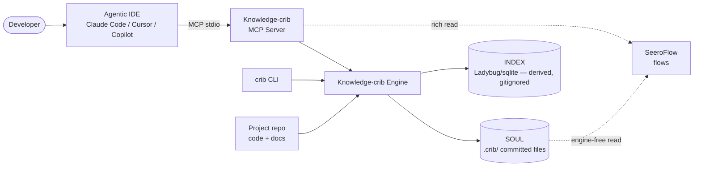
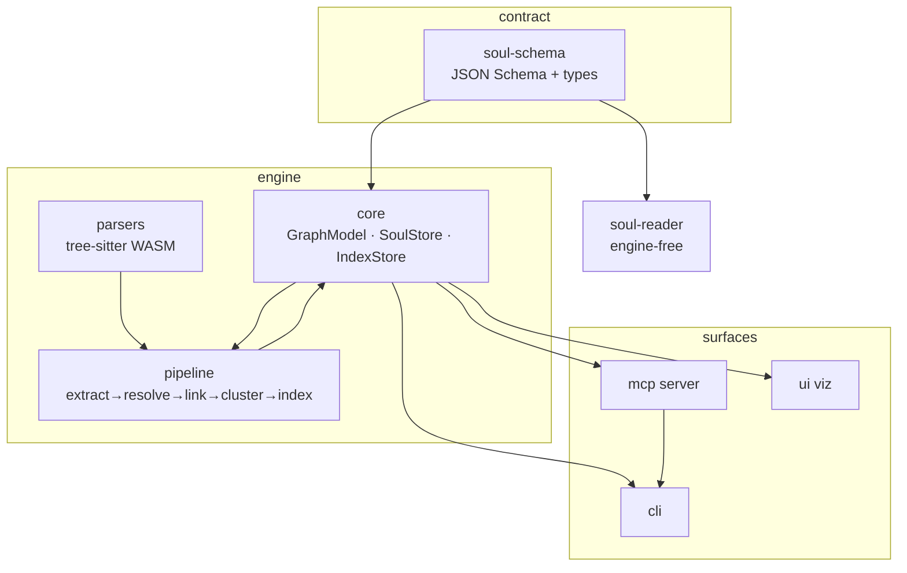
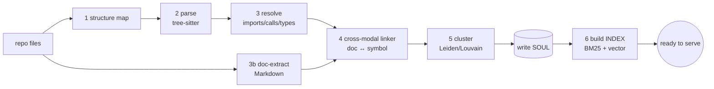
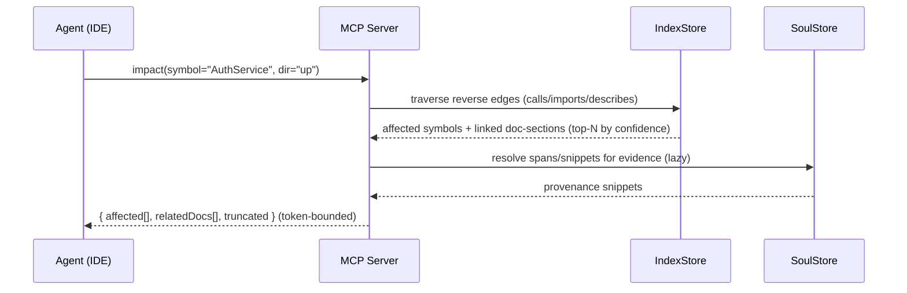
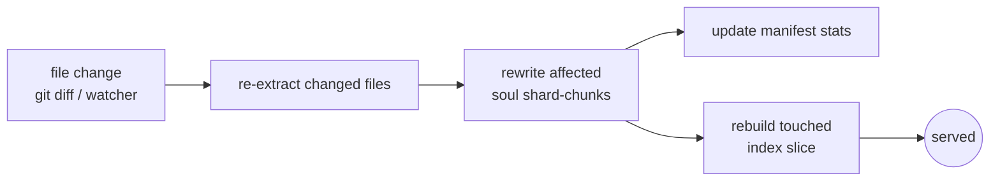

# Knowledge-crib — Architecture & System Design

> Greenfield TypeScript [Q36]. Storage = **soul (truth) + index (derived)** [Q9]. One MCP server
> [Q33], one UI [Q34]. Deterministic core; LLM opt-in [Q19]. See [decisions](knowledge-crib-decisions.md).

---

## 1. Design principles
1. **Soul is the source of truth; index is a rebuildable cache.** Single writer, one direction.
2. **Deterministic core never needs the network.** Parse/graph/impact/search are offline & free. LLM is opt-in enrichment only.
3. **Everything is a plugin at the edges.** Extractors (languages/formats) and the index backend are swappable behind interfaces.
4. **Token-frugal by construction.** Agents query the graph; payloads are bounded + provenance-tagged.
5. **Portable & cross-IDE.** The soul is plain committed files with a published schema; the MCP server is the fast path, raw files the universal path.

---

## 2. System context (who talks to what)


## 3. Component view (monorepo packages)


## 4. Data flow — indexing pipeline

All structure lands in the **soul first**; the index is built from the soul.

## 5. Sequence — an `impact` query


## 6. Soul ↔ index lifecycle (incremental)

Cost ∝ change size, not repo size. The index is always reconstructable from the soul → no drift.

## 7. Layering (dependency direction)
```
soul-schema  ◄── core ◄── pipeline ◄── mcp / cli / ui
soul-schema  ◄── soul-reader (no engine deps)
parsers ──► pipeline
```
- Nothing depends on a concrete index backend — only on the `IndexStore` interface.
- `soul-reader` depends only on `soul-schema` (so SeeroFlow can read without pulling the engine).

## 8. Key technical choices (and why)
| Choice | Why |
|--------|-----|
| TypeScript/Node [Q36] | best MCP SDK, `npx` cross-IDE distribution, tree-sitter WASM, embeddable store |
| tree-sitter WASM | one parser path for CLI + future browser UI; ~20 langs |
| JSONL sharded soul | git-diffable, streamable, small incremental writes (see soul-format) |
| `IndexStore` interface | swap LadybugDB ↔ sqlite+FTS5+sqlite-vec without touching soul or pipeline [C3] |
| MCP-first [Q22] | the agent is the primary consumer; UI is secondary |
| Deterministic core [Q19] | fast, free, offline, trustworthy; LLM only enriches |
| LLM via MCP **sampling** [Q18] | enrichment borrows the host IDE's model — no bundled provider/key, cross-IDE; fallback Ollama/cloud, else skip |

## 9. Non-goals (v1)
Multimodal ingestion (PDF/image/audio/video), Google Workspace, hosted multi-tenant SaaS, cloud
LLM by default. All deferred [Q24, Q32].
