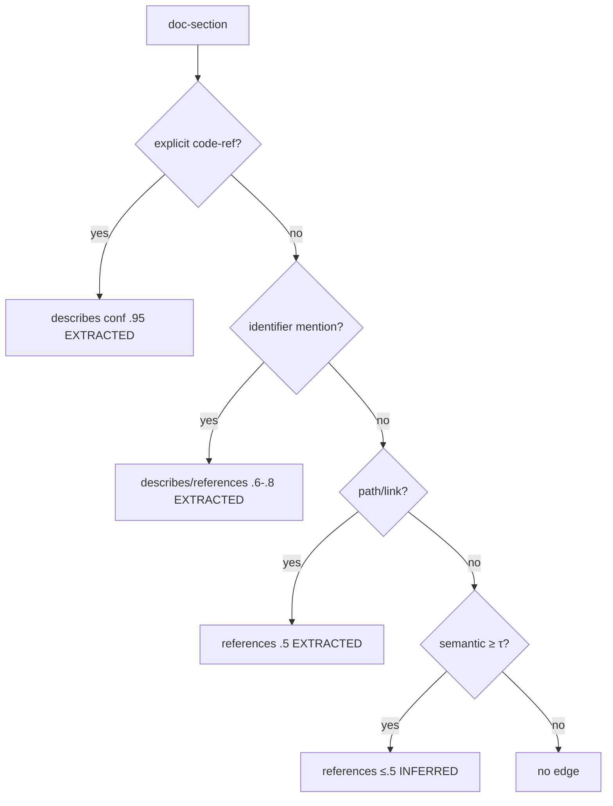

# Knowledge-crib — Indexing Pipeline & Algorithms

> Original implementation of the proven *phases* (inspired by GitNexus/Graphify, no code copied).
> All output is written to the **soul** first; the index is built from it. Deterministic phases tag
> edges `EXTRACTED`; the optional semantic linker tags `INFERRED` [Q19, Q35].

---

## Phase overview
| # | Phase | In | Out | Provenance |
|---|-------|----|-----|------------|
| 1 | Structure map | repo tree | `file` nodes | EXTRACTED |
| 2 | Parse | files | `symbol` nodes + intra-file edges | EXTRACTED |
| 3 | Resolve | symbols across files | `calls/imports/inherits/implements` edges | EXTRACTED |
| 3b | Doc-extract | Markdown | `doc-section` nodes (+ `member-of`) | EXTRACTED |
| 3c | SQL data-flow *(deep-extraction)* | SQL procs/DDL | `table`/`column`/`statement` + `reads`/`writes`/`executes` | EXTRACTED |
| 3d | CFG / conditions *(deep-extraction)* | procedure bodies | `guard`/`cfgPath` on calls + `condition` nodes | EXTRACTED |
| 4 | Cross-modal link | doc-sections + symbols | `describes/references` edges | EXTRACTED + INFERRED |
| 5 | Cluster | graph | `cluster` nodes + `member-of` | EXTRACTED |
| 6 | Index build | soul | IndexStore (BM25 + vectors) | — |

---

## Phase 1 — Structure map
Walk the repo (respect `.gitignore` + `--include/--exclude`). Emit a `file` node per source/doc
file with `lang` (by extension/tree-sitter detection) and content `hash`. Cheap; bounds the work set.

## Phase 2 — Parse (tree-sitter, WASM)
For each code file, parse to an AST and emit `symbol` nodes (class/function/method/interface/enum/
field/var) with `qualifiedName`, `span`, `signature`. Emit intra-file structural edges
(`member-of`, local `calls`). One grammar per language; missing grammar → file indexed at
file-level only (graceful degradation).

## Phase 3 — Resolve (the deep part)
Cross-file resolution — the GitNexus-grade depth:
- **imports/exports** → `imports` edges; build a module symbol table.
- **calls** → resolve callee by scope + import table + receiver type → `calls` edges.
- **inheritance/implements** → `inherits`/`implements` edges.
- **receiver-type inference** → disambiguate method calls on typed receivers (best-effort per lang).
All `method:static, provenance:EXTRACTED, confidence:1.0`. Unresolved calls are dropped (not guessed)
to keep the deterministic core trustworthy.

## Phase 3b — Doc-extract (Markdown, MVP)
Split MD by ATX/setext headings → one `doc-section` per heading subtree; emit `member-of` for
nesting. Capture inline-code and fenced-code spans as section metadata (fuel for the linker). Text
is referenced by span, not copied.

## Phase 3c — SQL data-flow *(deep-extraction / migration track)*
Parse DML in each procedure → `statement` nodes; resolve table/column refs against DDL →
`reads`/`writes`/`executes` edges. Answers "which proc touches which data, via which statement."

## Phase 3d — CFG / condition extraction *(deep-extraction — the deep part)*
Build a per-procedure control-flow graph (IF/ELSIF/ELSE/CASE/LOOP/EXCEPTION). For every call site and
statement, compute the **guard chain** from the procedure entry and attach `guard`/`cfgPath`/`branch`
to the edge (+ optional `condition` nodes). Deterministic → `EXTRACTED`. Language-specific; first
target PL/SQL. **This is what makes rule-engine migration possible** — the conditions are the rules.
See [deep-extraction](knowledge-crib-deep-extraction.md) [Q40].

## Phase 4 — Cross-modal linker (the differentiator)
Produces `describes`/`references` edges between `doc-section` and `symbol`, with provenance. Runs
after symbols are resolved.

**Signals (cheap → expensive):**
| # | Signal | `method` | conf | mechanism |
|---|--------|----------|------|-----------|
| 1 | Explicit code-ref | `explicit` | 0.95 | fenced/inline-code token == symbol `qualifiedName` or `path#symbol` |
| 2 | Identifier mention | `identifier` | 0.6–0.8 | symbol name at word boundary (camel/snake/kebab variants); boosted if module-siblings co-occur |
| 3 | Path/link mention | `path` | 0.5 | MD link/text path → all symbols in that file (`references`) |
| 4 | Semantic | `semantic` | ≤0.5 | ANN over vector index; standalone only as `references`, capped so it never outranks deterministic |
| 5 | Heading scope | — | — | a section's links bias its `member-of` subtree |

**Scoring:** `conf = max(signalConf)` + small additive boost when signals agree (cap 0.99).
**Edge type:** `describes` if `conf ≥ 0.8` and `method ∈ {explicit, identifier}`; else `references`.
**Provenance:** signals 1–3,5 → `EXTRACTED`; signal 4 → `INFERRED`.
**Persist:** edge iff `conf ≥ --link-threshold` (default 0.4).

**Complexity (never O(docs × symbols)):**
- Build inverted index `symbolName → symbol[]` once → deterministic passes are O(doc tokens).
- Semantic uses the ANN vector index for candidates only.
- Name-collision disambiguation by module/file proximity.

## Phase 5 — Cluster
Community detection (Leiden via a JS port, or Louvain) over the structural graph → `cluster` nodes
with `member-of` edges. Optional cluster **naming** uses the host IDE's LLM via **MCP `sampling`**
(fallback Ollama/cloud; skippable) — enrichment only, tagged `INFERRED`.

## Phase 6 — Index build
`IndexStore.buildFromSoul`: build BM25 over symbol/doc text + (optional) vector embeddings for
hybrid search; materialize adjacency for fast `impact`/`neighbors` traversal. Fully derived —
`crib reindex` rebuilds it from the soul anytime.

## Incremental update
1. Changed files since `manifest.incrementalSince` (git diff/watcher).
2. Re-run phases 2–4 for those files only.
3. Diff by node `hash` → rewrite only affected soul shard-chunks; prune dangling edges in touched shards.
4. Rebuild only the touched index slice; update manifest stats + `vcsHead`.

## Determinism & trust guarantees
- Phases 1–3,3b,5 are fully deterministic and offline.
- Only Phase 4 signal-4 and cluster-naming may use an LLM, always tagged `INFERRED` and filterable.
- An `EXTRACTED`-only view is always available (trust mode).
