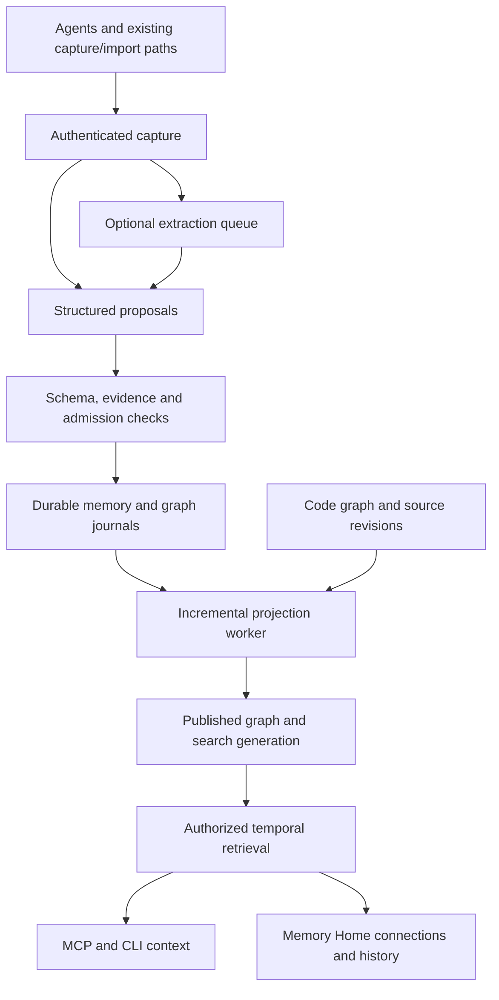

# Knowledge Crib connected memory graph: developer-launch implementation plan

> **Status:** QUEUED — starts only after the 11-task "Detailed Development Plan to Reach GO"
> (Tasks 1–11) is fully implemented, verified, and pushed to `cmp-remote` on `debug/auditMaster`.
> Received 2026-09-14. Nothing in this file has been implemented yet.

## 1. Outcome and architectural direction

**Build a local-first, temporal memory graph that connects developer knowledge across repositories and supported agents on one device. Make this capability a requirement for the current developer launch.**

The agreed scope is:

- Developer knowledge: memories, projects, code, concepts, decisions, evidence, and work history.
- Hybrid capture: explicit agent proposals plus optional model-assisted extraction, both subject to the same admission rules.
- Existing principal isolation, local/global memory, recovery, semantic retrieval, and client certification remain mandatory.
- Hosted multi-tenancy, external business connectors, and production cross-device sync remain excluded.

The launch must demonstrate this complete journey:

> An agent records a decision with evidence and links it to affected code. Another authorized agent retrieves that connected context. A later decision replaces the first. Knowledge Crib explains both the current decision and its history after a restart or index rebuild.

**Recommended stack:** retain TypeScript, Node, durable memory journals, SQLite, FTS, the existing semantic retrieval tier, and MCP. Add a temporal graph domain and derived indexes. A separate graph database is unnecessary for the first implementation.

The repository already contains useful foundations:

- Memory records carry namespace, evidence, valid time, transaction time, and lineage.
- Memory composite projections connect claims to code, supporting evidence, and conflicts.
- SQLite provides code adjacency and search indexes.
- Purge distinguishes local/global physical removal from Git-backed team retraction.

These are implementation foundations, not proof that the proposed connected-memory behavior already works. The inspected running index was behind the checkout; implementation must revalidate against the integrated launch branch.

Temporal relationships are an established agent-memory architecture pattern. GraphRAG also distinguishes entity-focused retrieval from corpus-wide community summarization. This plan adopts temporal connections and bounded retrieval; community-report generation is outside the launch scope. [Temporal memory research](https://arxiv.org/abs/2501.13956), [GraphRAG query architecture](https://microsoft.github.io/graphrag/query/overview/).

## 2. Target architecture and public contracts

### Authoritative records and rebuildable projections

Keep existing memory records authoritative for claims. Add separately versioned graph records that reference those claims. Do not rewrite immutable v3 records or expand the code graph's closed node/relation enums to accommodate memory types.

Implement the memory graph domain within the memory package. Core retains generic indexing primitives; MCP and UI consume the same authorized graph service. Avoid a dependency from core back into memory.

### Domain model

| Object | Purpose and required behavior |
|---|---|
| Entity | A scoped project, repository, service, concept, or artifact with a stable identity. Labels are editable metadata, not identity. |
| Claim | A reference to an existing immutable memory record. Decisions and procedures retain their existing memory kinds. |
| Relationship assertion | A versioned subject–predicate–object assertion with namespace, supporting references, provenance, and temporal information. |
| Episode | A reference to a sanitized capture or attempt summary; never an automatically retained full conversation. |
| Work reference | A link to an existing intake or checkpoint, preserving its authorization and completion state. |
| Resolution decision | An append-only decision establishing or reversing an entity alias. |
| Retraction/supersession | A lifecycle decision changing current eligibility while preserving authorized history where retention permits. |

Start with a bounded relation vocabulary:

`about`, `applies-to`, `supported-by`, `derived-from`, `supersedes`, `contradicts`, `part-of`, and `affects`.

Keep extracted code relations identifiable as code facts. Any semantic relationship inferred by an agent or model must retain that provenance.

Each relationship assertion must carry:

- A content-addressed ID and schema version.
- Server-resolved namespace and explicit store scope.
- Typed subject and object references.
- A registered predicate.
- Supporting memory/evidence references.
- Producer provenance and source revision/hash.
- Valid-time information where known, plus observed/recorded timestamps.

Admission status is derived from lifecycle decisions and evidence checks. A producer cannot submit `trusted: true`.

### Identity, authorization, and time

- Scope entity identity by principal and owning store/project. Identical names in different repositories do not imply identical entities.
- Reuse exact existing identifiers where available. Similarity may suggest an alias but never silently merge entities.
- Cross-repository identity requires an explicit authorized link or alias decision.
- Agent, IDE, and server-session identifiers describe provenance; they do not grant access.
- Authorize seeds, intermediate nodes, edges, evidence, counts, exports, and cursor continuations before exposing them.
- A relationship is visible only when the caller can access the relationship and its endpoints.
- Cross-store references do not copy private content into a broader store. Sharing continues through the existing explicit sharing boundary.

Expose two temporal coordinates:

- `validAt`: when the assertion applied in the represented world.
- `knownAt`: what had been recorded by a particular time.

Default to the current eligible projection. Historical queries never bypass current authorization, purge, or retention restrictions. Unknown valid time remains unknown; do not invent it from ingestion time.

### Public interfaces

Add one read-only MCP tool, `memory_graph`, with operations:

| Operation | Behavior |
|---|---|
| `search` | Find authorized entities and graph-linked claims. |
| `neighbors` | Return a bounded neighborhood with relationship evidence. |
| `path` | Find an authorized path between specified references. |
| `history` | Explain recorded changes, contradictions, and supersession. |
| `context` | Produce a token-bounded context pack for a question or intake. |

Common inputs include scope, temporal coordinates, relation filters, traversal limits, token budget, and cursor. Authentication context comes from the server, never a caller-supplied principal override.

Common outputs include results, supporting references, generation, freshness, truncation, continuation cursor, and explicit degradation reasons.

Defaults:

- Two-hop traversal; hard maximum four hops.
- Maximum 200 visited nodes and 500 examined edges per request.
- Context budget of 2,000 tokens unless the caller requests a lower supported budget.
- Cursors bound to principal, query, filters, and generation; changed generations require a fresh query.
- Pending proposals remain outside ordinary graph search and context.

Extend existing memory mutation operations for graph proposals and alias decisions. Admission uses the existing evidence policy; add no unrestricted raw edge insertion endpoint.

Update the MCP capability manifest, schemas, CLI wrappers, help, and generated documentation together.

## 3. Implementation work packages

Execute these packages in dependency order. Use separate commits for contracts, storage, retrieval, and client-facing changes. Revalidate the ongoing launch repairs before integrating overlapping changes.

### WP-G0 — Establish the integrated baseline and evaluation fixtures

1. Integrate or identify the completed launch-repair baseline without overwriting another agent's work.
2. Record candidate commit, package identity, schema/policy versions, and existing gate results.
3. Refresh the repository graph during implementation and inspect coverage limitations.
4. Create isolated fixtures covering two principals, two repositories, local/global memory, decisions, conflicting claims, renamed code, and unfinished/completed intakes.
5. Freeze graph evaluation questions and expected evidence paths before tuning retrieval.

**Exit:** reproducible baseline, explicit remaining launch blockers, and a versioned graph acceptance corpus.

### WP-G1 — Add graph contracts and durable storage

1. Implement graph entity, assertion, and resolution-decision schemas with strict validation and unknown-version rejection.
2. Store new graph records through the existing store locking and journal discipline.
3. Make proposal submission idempotent using scoped content identity.
4. Acknowledge writes only after the canonical append is durable.
5. Treat a durable journal append followed by interrupted indexing as recoverable projection lag.
6. Backfill only relationships directly supported by existing structured fields.
7. Report unresolved subjects and missing evidence anchors instead of inventing links.

Do not rewrite existing memory IDs during backfill. Keep graph metadata additive and independently versioned.

**Exit:** repeated imports produce the same canonical assertions; interrupted writes and projection restarts do not lose acknowledged work.

### WP-G2 — Build authorized temporal projections

1. Implement current and historical graph projection from canonical records and lifecycle decisions.
2. Apply namespace and endpoint authorization within traversal and search.
3. Preserve separate contradictory assertions; never use last-write-wins as a truth policy.
4. Implement reversible aliases with deterministic resolution and cycle rejection.
5. Add adjacency, temporal, evidence-reference, and scoped lookup indexes in SQLite.
6. Exclude unsupported or unresolved relationships from trusted traversal while retaining diagnostic visibility for the owner.

Reuse the current memory composite boundary. Provide a bridge from graph references to code symbols rather than inserting memory objects into the source schema.

**Exit:** authorized queries return correct current/history views, including through paths, counts, and exports.

### WP-G3 — Implement incremental freshness and recovery

1. Record projection progress against durable source positions and code generation.
2. Build graph and associated search changes into a staging generation.
3. Publish a single manifest only after all required projections are complete.
4. Pin each request to one published generation.
5. Replay interrupted projection work idempotently after restart.
6. Reuse the launch worker's renewable lease protections; perform substantial indexing away from the MCP request loop.
7. Trigger refresh from capture, admission, retraction, alias changes, evidence changes, code updates, and retention actions.

Expose source positions, indexed/current HEAD, published/reader generation, refresh state, last success, and last error.

Authorization revocation and purge must take effect immediately through a current deny/retraction check, even when a reader holds an older generation. Such readers must not continue serving removed content.

**Exit:** connected readers converge automatically, and no request combines incompatible graph/search generations.

### WP-G4 — Add controlled hybrid capture

Support both explicit structured proposals and optional extraction from eligible existing captures.

For launch, use **agent-mediated extraction jobs**: Knowledge Crib queues bounded jobs, and a compatible connected agent supplies structured model output. No resident generation model or mandatory cloud service is introduced.

Each extraction job records:

- Authorized source references and source hashes.
- Ontology/schema version.
- Producer, model, and prompt revision when supplied.
- Idempotency identity, lease, attempt count, and outcome.

Use three automatic attempts before moving a failed job to a visible retry queue. Expired leases permit recovery; completed output is committed once.

Extraction results are candidates. Validate schema, scope, source references, and evidence before admission. A source hash change invalidates outstanding output.

If no capable extractor is connected, show the job as waiting. Existing capture, recall, and explicit graph proposals remain available.

**Exit:** the same capture can be retried or reprocessed without duplicate assertions, unauthorized links, or silently trusted model output.

### WP-G5 — Add connected retrieval and context assembly

1. Use current lexical/semantic retrieval to find authorized seed claims and entities.
2. Expand through allowed graph relationships within the fixed traversal budget.
3. Rank graph candidates deterministically using seed relevance, path length, evidence eligibility, and stable ID tie-breaking.
4. Preserve distinct text-search scores and graph-path explanations; do not imply they are calibrated confidence.
5. Deduplicate repeated claims and evidence within the final token budget.
6. Return conflicting claims together when applicable.
7. Include provenance and evidence paths in context packs.
8. Keep historical material in an explicitly historical group.

Ship connected retrieval as an additive mode. Preserve existing plain recall behavior and frozen semantic gates. On graph failure, provide existing recall with an explicit graph-unavailable signal; never return a graph success receipt for that fallback.

**Exit:** connected questions gain supporting context without contaminating ordinary recall or exceeding declared budgets.

### WP-G6 — Extend retention, purge, and recovery

1. Extend retraction and purge to graph assertions, entity labels derived exclusively from purged content, FTS rows, embeddings, extraction jobs, and cached context.
2. Remove dangling relationships and prevent their recreation during replay.
3. Preserve an entity if other authorized retained evidence independently supports it.
4. Reapply retained tombstones before serving restored data.
5. Include graph journals and projection metadata in backup/recovery validation.
6. Maintain current local/global versus team purge semantics, including Git-history limitations.

Default admitted knowledge to the existing retention policy; add no automatic age-based forgetting. Access frequency may influence retrieval, but must not silently delete or extend retention.

Keep graph synchronization disabled in the launch preview unless its versioned records and tombstones pass the sync compatibility suite. Unsupported peers must fail explicitly rather than silently drop graph records.

**Exit:** rebuilding or restoring the graph cannot resurrect content covered by retained deletion decisions.

### WP-G7 — Deliver Memory Home and adapter workflows

Add **Connections** and **History** views to existing memory detail flows:

- Select a claim to see linked entities, evidence, related code, and authorized work.
- Expand neighborhoods progressively.
- Open a relationship to inspect its source, time, provenance, and admission status.
- Inspect proposed aliases before accepting them.
- Surface unresolved links and extraction failures with actionable repair controls.
- Keep pending admission and resumable work tiles actionable.
- Exclude completed work from resume counts.

Provide an accessible list representation for every graph view. At 390px, use the list/detail flow as the primary interaction. Preserve keyboard navigation, Escape dismissal, focus return, and existing contrast requirements.

Extend each advertised adapter's runtime scenario to create, retrieve, supersede, restart, and resume connected memory. Record actual client and protocol versions.

**Exit:** the feature is usable through both MCP and the browser, with equivalent authorization.

### WP-G8 — Produce candidate-bound release evidence

1. Add graph gate receipts to the release evidence schema and validator.
2. Bind receipts to the clean candidate commit, installed package digest, platform, schema/policy versions, fixtures, and model/client versions.
3. Require real artifacts and independently validate their identity and checksums.
4. Generate the capability matrix from validated receipts.
5. Run against the packaged installation, including recovery and client workflows.
6. Publish graph limitations and operating boundaries alongside capabilities.

**Exit:** the launch decision cannot pass using missing, stale, synthetic, or mismatched graph evidence.

## 4. Verification and actual GO criteria

The following graph thresholds are **proposed acceptance requirements, not measured results**. Freeze them with the fixtures before implementation tuning.

| Gate | Required evidence |
|---|---|
| Isolation | Zero foreign nodes, edges, evidence, counts, aliases, history, exports, or recovery disclosures across the adversarial principal suite. |
| Temporal correctness | All deterministic cases pass for unknown time, overlapping validity, late arrival, supersession, contradiction, and historical queries. |
| Durable recovery | Every acknowledged fixture write survives forced process termination; duplicate replay creates no duplicate logical assertions. |
| Retention | Purged content is absent from all supported serving surfaces and remains absent after index rebuild and restore with retained tombstones. |
| Connected retrieval | At least 90% expected evidence-path recall on a held-out suite of at least 100 multi-hop questions; zero unauthorized or ineligible supporting paths. |
| Semantic preservation | Existing eight semantic gates pass unchanged, including G2 ≥80% and G3 ≥0.75. |
| Freshness | Save, rename, delete, clean checkout, merge/rebase, external update, and restart converge without manual update; no falsely fresh mixed generation. |
| Local performance | On an archived reference machine with 100,000 assertions: warm bounded graph reads p95 ≤500 ms; context assembly p95 ≤1 s, excluding model execution. |
| Update latency | Single admitted assertion visible within two seconds p95 when no bulk rebuild is running; backlog and stale status remain truthful during bulk work. |
| Browser | Required workflows pass at 390px and desktop widths, including keyboard-only use and accessible list alternatives. |
| Clients/platforms | Required launch certification matrix passes using actual installations and candidate-bound receipts. |

Add property-based tests for alias cycles, replay ordering, duplicate deliveries, partial projection failure, contradictory histories, and authorization changes during pagination.

The final packaged end-to-end scenario must:

1. Start with isolated memory homes and two principals.
2. Capture and admit a decision linked to evidence and code.
3. Retrieve it through another authorized client session.
4. Demonstrate foreign-principal exclusion.
5. Change code and verify automatic freshness.
6. Supersede the decision and verify current and historical answers.
7. Interrupt extraction and projection, then restart.
8. Purge a supporting record and verify all derived surfaces.
9. Rebuild indexes and repeat the checks.
10. Archive the execution artifacts and validated receipts.

**GO requires the existing launch gates and every graph gate to pass for the same release candidate.** A skipped platform, unavailable runtime, failing graph gate, or unverifiable receipt means NO-GO for the agreed launch scope.

## 5. Delivery sequence and release boundaries

Deliver in five reviewable milestones:

1. **Contracts and replay:** WP-G0–G1.
2. **Authorized temporal graph:** WP-G2–G3.
3. **Capture and retrieval:** WP-G4–G5.
4. **Retention and user workflows:** WP-G6–G7.
5. **Packaged certification and GO:** WP-G8 plus the complete gate suite.

Use a development feature flag while these milestones are incomplete. Enable connected graph functionality in the release candidate used for final certification. Optional extraction remains opt-in.

Rollback disables connected retrieval and rebuilds derived indexes without deleting canonical graph records. Older releases must explicitly reject unsupported graph writes. Do not silently downgrade their storage format.

Defer graph-database replacement, custom enterprise ontologies, community summarization, external connectors, and production graph synchronization. Introduce them only through separately measured requirements and compatibility gates.

The resulting launch promise is concrete:

> **Knowledge Crib retains evidence-backed developer knowledge across supported agents on one device, connects it to code and work, explains how it changed, and recovers those connections from durable records.**